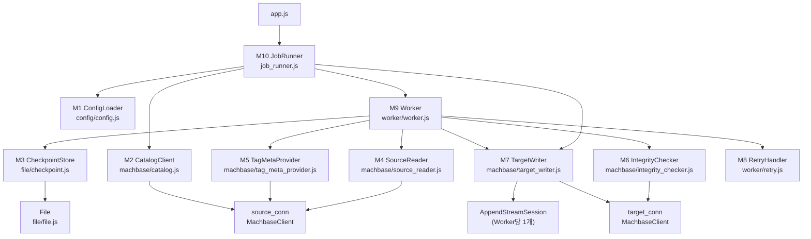
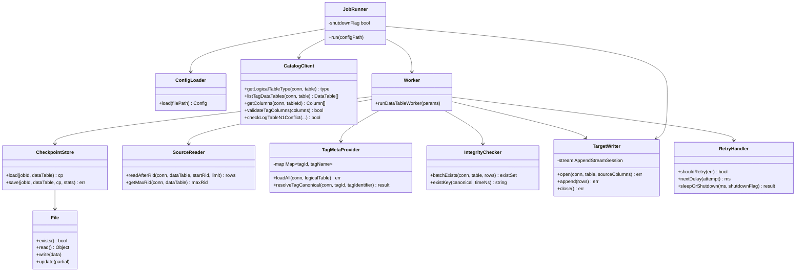
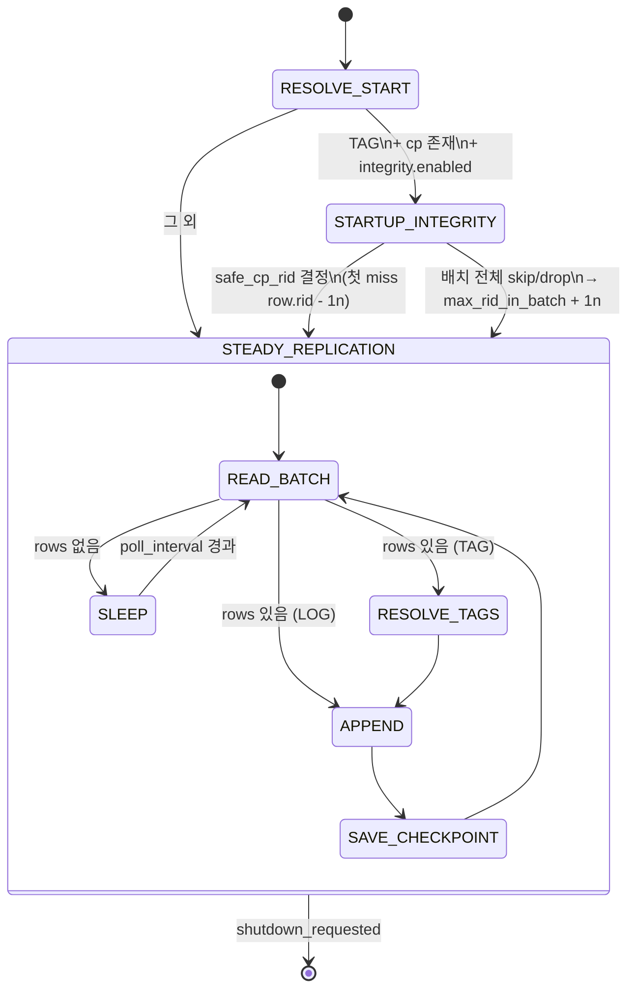
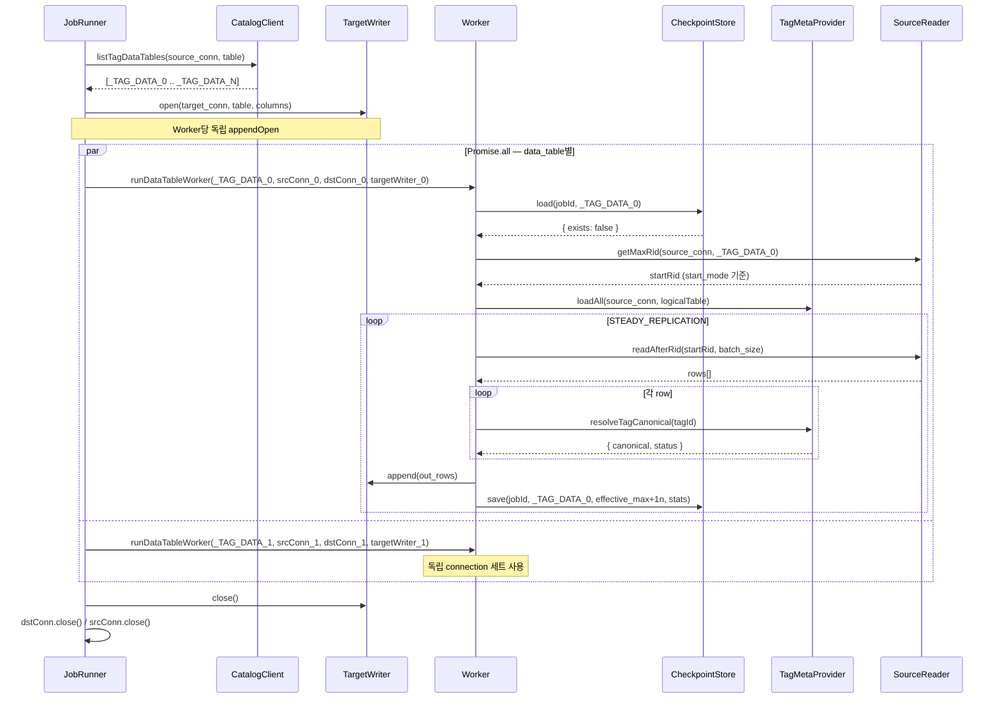

# repli-js 프로젝트 문서

**프로젝트**: Machbase TAG / Log 테이블 복제 도구
**런타임**: Node.js v22 (CommonJS)
**최종 수정**: 2026-02-24

---

## 목차

1. [프로젝트 개요](#1-프로젝트-개요)
2. [시스템 아키텍처](#2-시스템-아키텍처)
3. [설정 스키마](#3-설정-스키마)
4. [모듈 명세](#4-모듈-명세)
5. [핵심 동작 흐름](#5-핵심-동작-흐름)
6. [경계 조건 및 예외 시나리오](#6-경계-조건-및-예외-시나리오)
7. [에러 처리 정책](#7-에러-처리-정책)
8. [고정 정책 vs 설정 가능 항목](#8-고정-정책-vs-설정-가능-항목)
9. [테이블 타입별 동작 비교](#9-테이블-타입별-동작-비교)
10. [UML 다이어그램](#10-uml-다이어그램)
11. [구현 현황](#11-구현-현황)
12. [미결 사항 및 향후 과제](#12-미결-사항-및-향후-과제)

---

## 1. 프로젝트 개요

### 1.1 목적

원본 Database의 TAG / Log 테이블 데이터를 대상 Database 테이블로 지속 복제한다.
트랜잭션·PK가 없는 환경에서 `_rid` 기반 체크포인트를 활용하여 **at-least-once** 복제를 달성하고, 가능한 범위 내에서 정합성을 최대화한다.

### 1.2 목표 / 비목표

| 구분 | 항목 |
|------|------|
| **목표** | at-least-once 복제, 정합성 최대화 (Tag 테이블), Graceful Shutdown |
| **비목표** | Exactly-once 보장, Update/Delete 복제, 대상 테이블 생성/스키마 관리 |

### 1.3 핵심 제약

- DB 트랜잭션 없음, PK 없음 → 중복 발생 허용 (at-least-once)
- 복제 단위: `_rid` 기반 배치
- 설정 변경 시 프로세스 재시작 필요 (핫 리로드 미지원)

### 1.4 핵심 의존성

- `@machbase/ts-client@0.9.3` — CMI 프로토콜 기반 Machbase 네이티브 클라이언트

### 1.5 용어 정의

| 용어 | 정의 |
|------|------|
| 논리 테이블 | 원본 테이블. 실제 데이터를 저장하지 않고 메타 및 데이터 테이블 구성 정보만 보유 |
| 데이터 테이블 | 실제 데이터가 저장되는 테이블. Tag 테이블의 경우 `{logical}_DATA_{index}` 형태 |
| `_rid` | 데이터 테이블별 순차적이고 unique한 일련번호 (단조 증가) |
| 체크포인트 | 데이터 테이블별 마지막 성공 복제 `_rid` (파일로 저장) |
| canonical tag_name | tag_id → tag_name 변환 후 tag_identifier(prefix/suffix/none)를 적용한 최종 tag_name' |
| mapping | 하나의 소스 논리 테이블과 대상 테이블 간의 복제 단위 설정 |
| Worker | data_table 1개당 생성되는 독립 복제 실행 단위 |
| STARTUP_INTEGRITY | 재시작 직후 수행하는 중복 skip 및 시작 위치 보정 단계 (Tag 전용) |
| STEADY_REPLICATION | 정상 복제 루프 |
| effective_max | STEADY에서 checkpoint advance 기준이 되는 `_rid` 값 (max_written_rid 또는 max_rid_in_batch) |

---

## 2. 시스템 아키텍처

### 2.1 디렉토리 구조

```
repli-js/
├── app.js                      # 진입점 — JobRunner 호출
├── config.json                 # 설정 파일 (v3 스키마)
├── config/
│   └── config.js               # M1: ConfigLoader
├── machbase/
│   ├── machbase.js             # 저수준 연결/쿼리 (MachbaseClient)
│   ├── catalog.js              # M2: CatalogClient
│   ├── source_reader.js        # M4: SourceReader
│   ├── tag_meta_provider.js    # M5: TagMetaProvider
│   ├── integrity_checker.js    # M6: IntegrityChecker
│   └── target_writer.js        # M7: TargetWriter
├── file/
│   ├── file.js                 # JSON 파일 읽기/쓰기 (atomic write, BigInt 지원)
│   └── checkpoint.js           # M3: CheckpointStore
├── worker/
│   ├── retry.js                # M8: RetryHandler
│   └── worker.js               # M9: Worker 상태 머신
├── job_runner.js               # M10: JobRunner
├── tests/
│   ├── unit/
│   └── integration/
└── package.json
```

### 2.2 컴포넌트 구성

```
┌─────────────────────────────────────────────────────────┐
│  Main Process                                           │
│                                                         │
│  ConfigLoader ──→ JobRunner                             │
│                      │                                  │
│                      ├─ CatalogClient (소스 DB)         │
│                      ├─ CheckpointStore (파일)          │
│                      └─ [Worker × N] ─────────┐         │
│                                               │         │
│  Worker (data_table 1개당 1개, concurrent)    │         │
│  ┌────────────────────────────────────────┐   │         │
│  │  SourceReader     (소스 DB 읽기)       │   │         │
│  │  TagMetaProvider  (소스 DB 메타 조회)  │   │         │
│  │  IntegrityChecker (대상 DB 존재 확인)  │   │         │
│  │  TargetWriter     (대상 DB 쓰기)       │   │         │
│  │  CheckpointStore  (파일 갱신)          │   │         │
│  └────────────────────────────────────────┘   │         │
└───────────────────────────────────────────────┘─────────┘
```

### 2.3 Connection 관리 원칙 (설계 결정 B-01)

> **설계 번복 사유**: 통합 테스트 중 `@machbase/ts-client`가 단일 connection에서 동시 query 또는 append 호출 시 `"Unexpected protocol N, expected M"` 오류 발생 확인.

**확정 구조**: data_table(Worker)당 srcConn + dstConn + TargetWriter 각 1개 생성

```
mapping (소스 table → 대상 table)
  [DISCOVER]  source_conn: 1개  ── 카탈로그 조회 후 close

  [Worker_0]  srcConn_0 + dstConn_0 + TargetWriter_0 (appendOpen 포함)
  [Worker_1]  srcConn_1 + dstConn_1 + TargetWriter_1 (appendOpen 포함)
  ...
  [Worker_N]  srcConn_N + dstConn_N + TargetWriter_N (appendOpen 포함)
```

- data_table(파티션) 1개당 Worker 1개, 각 Worker는 독립된 connection 세트 보유
- STARTUP_INTEGRITY에서 intConn(integrity 전용)은 배치마다 새로 생성 후 close
  - `MachbaseFacadeConnection.end()` 호출 후 재연결 불가 → 재사용 금지
  - statement ID 서버 한도(1024개/connection)를 초과하지 않도록 배치마다 신규 생성

### 2.4 Machbase TAG 테이블 내부 구조

| 시스템 테이블 | 역할 |
|--------------|------|
| `_TAG_META` | 태그 메타 정보 (태그 이름 → `_ID` 매핑) |
| `_TAG_DATA_0` ~ `_TAG_DATA_N` | 실제 데이터 파티션 |
| `V$STORAGE_TAG_TABLES` | 파티션별 RID 범위 등 스토리지 정보 |
| `M$SYS_TABLES` / `M$SYS_COLUMNS` | 시스템 카탈로그 |

### 2.5 시스템 상태 머신

**시스템 레벨**
```
INIT → DISCOVER → [Worker 병렬 실행] → STOPPED
```

**Worker 레벨 (data_table 1개당)**
```
RESOLVE_START → (STARTUP_INTEGRITY, TAG+체크포인트 존재 시) → STEADY_REPLICATION
```

---

## 3. 설정 스키마

### 3.1 최상위

| 필드 | 타입 | 필수 | 설명 |
|------|------|------|------|
| version | int | ✅ | 3 고정 |
| servers | map\<string, ServerConfig\> | ✅ | 서버 별칭 → 접속 정보 |
| replication.jobs | Job[] | ✅ | 복제 작업 목록 |

### 3.2 ServerConfig

```js
{
  host: string,
  port: number,
  user: string,
  password: string,
  database?: string,
  timezone?: string,
}
```

### 3.3 Job

| 필드 | 타입 | 기본값 | 설명 |
|------|------|--------|------|
| job_id | string | — | 고유 식별자 |
| enabled | bool | — | 실행 여부 |
| shutdown_timeout_ms | int | 30000 | Worker 종료 대기 타임아웃 (ms) |
| checkpoint.directory | string | — | 체크포인트 파일 저장 경로 |
| checkpoint.on_save_failure | "continue"\|"abort" | "continue" | 저장 실패 정책 |
| integrity.enabled | bool | — | 재시작 정합성 유지 여부 |
| integrity.mode | "existence_only" | — | 정합성 비교 방식 (현재 고정) |
| retry.enabled | bool | — | 재시도 활성화 |
| retry.strategy | "exponential"\|"linear" | — | 대기 증가 방식 |
| retry.initial_delay_ms | int | — | 최초 재시도 대기 (ms) |
| retry.max_delay_ms | int | — | 최대 재시도 대기 (ms) |
| retry.multiplier | float | — | 지수 증가 계수 |
| retry.jitter | bool | — | 랜덤 변동 적용 |
| retry.max_attempts | int\|null | null | 최대 횟수 (null = 무한) |
| execution_defaults.batch_size_records | int | 5000 | 배치당 최대 레코드 수 |
| execution_defaults.poll_interval_ms | int | — | 폴링 주기 (ms) |
| logging.level | "debug"\|"info"\|"warn"\|"error" | — | 로그 레벨 |
| logging.log_dir | string | — | 로그 파일 경로 |

### 3.4 Mapping

| 필드 | 타입 | 설명 |
|------|------|------|
| mapping_id | string | 고유 식별자 |
| source.server | string | servers 별칭 참조 |
| source.table | string | 원본 논리 테이블명 |
| source.start_mode | "full"\|"now"\|"rid_after" | 최초 실행 시작 기준 |
| source.rid_after | int\|null | start_mode=rid_after 시 기준 rid |
| source.tag_identifier.mode | "prefix"\|"suffix"\|"none" | tag name 식별자 방식 |
| source.tag_identifier.value | string | 적용 문자열 (구분자 포함) |
| source.execution | ExecutionOptions | source 레벨 실행 옵션 override |
| target.server | string | servers 별칭 참조 |
| target.table | string | 대상 테이블명 (사전 생성 필요) |
| execution | ExecutionOptions | mapping 레벨 실행 옵션 override (최우선) |

### 3.5 execution 필드 레벨 merge 규칙

각 필드(`batch_size_records`, `poll_interval_ms`)는 **독립적으로** 다음 우선순위를 따른다:
```
1순위: mapping.execution.{field}
2순위: source.execution.{field}
3순위: job.execution_defaults.{field}
```

### 3.6 체크포인트 파일 포맷

**파일명**: `{checkpoint.directory}/{job_id}__{data_table}.json`

```json
{
  "version": 1,
  "job_id": "<string>",
  "source": {
    "server": "<server_alias>",
    "table": "<logical_table>",
    "data_table": "<data_table_name>"
  },
  "checkpoint": {
    "last_success_rid": "<BigInt as string>",
    "updated_at": "<RFC3339>"
  }
}
```

---

## 4. 모듈 명세

### M1. ConfigLoader (`config/config.js`)

```js
ConfigLoader.load(filePath) → Config
```

**구현 항목**
- JSON.parse로 파일 읽기
- 필수 필드 검증: version==3, servers, replication.jobs
- servers 별칭 참조 유효성 (source.server, target.server가 servers에 존재)
- start_mode 값 범위: "full" | "now" | "rid_after"
- rid_after: start_mode=="rid_after"일 때 필수
- on_save_failure: "continue" | "abort" (기본값: "continue")
- shutdown_timeout_ms: 양의 정수 (기본값: 30000)
- batch_size_records 기본값: 5000
- execution 필드 레벨 merge: mapping > source > job (필드 독립 적용)

---

### M2. CatalogClient (`machbase/catalog.js`)

```js
CatalogClient.getLogicalTableType(conn, table) → { type: "TAG"|"LOG"|"UNSUPPORTED" }
CatalogClient.listTagDataTables(conn, logicalTable) → DataTable[]
CatalogClient.getColumns(conn, tableId) → Column[]
CatalogClient.validateTagColumns(columns) → bool
CatalogClient.checkLogTableN1Conflict(mappings, logicalTable, targetServer, targetTable) → bool
```

**구현 항목**
- `M$SYS_TABLES.TYPE`: 6=TAG, 0=LOG, 그 외=UNSUPPORTED
- `V$STORAGE_TAG_TABLES + M$SYS_TABLES` 조인으로 data_table 목록 조회
- TAG 컬럼 규칙: 1번째 컬럼 tag id(integer 계열), 2번째 컬럼 time(int64) — 위반 시 mapping 스킵
- Log 테이블 n:1 매핑 금지: DISCOVER 단계에서 동일 target.server+target.table에 다수 Log mapping 시 두 번째 이후 스킵
- `getColumns` 필터: `c.ID >= 0 AND c.ID < 65534` (논리 테이블 NAME 컬럼(ID=0) 포함)
- TAG 컬럼 타입 허용 코드: time은 `TIME_TYPE_CODES = Set([12, 6])`

---

### M3. CheckpointStore (`file/checkpoint.js`)

```js
CheckpointStore.load(jobId, dataTable) → { cp, exists, err }
CheckpointStore.save(jobId, dataTable, cp, stats) → err
```

**구현 항목**
- `File` 클래스를 기반으로 atomic write 활용 (tmp 파일 → rename)
- 파일 없음 → `{ exists: false, err: null }`
- JSON 파싱 실패 → `{ exists: false, err: ... }` + stage="checkpoint_io" 로그
- `source.data_table` ≠ 파일명 내 data_table → 손상 처리, 무효화
- `on_save_failure="continue"`: 오류 로그 + Worker 메모리 기준 rid로 계속
- `on_save_failure="abort"`: TODO (현재 continue와 동일하게 동작)
- 저장 성공 시 `checkpoint_saved` 구조화 로그 출력 (stats 4개 필드 포함)

---

### M4. SourceReader (`machbase/source_reader.js`)

```js
SourceReader.readAfterRid(conn, dataTable, logicalTable, startRid, limit) → { rows, err }
SourceReader.getMaxRid(conn, dataTable) → { maxRid, err }
```

**SQL (설계 결정 D-01)**
```sql
SELECT /*+ RID_RANGE(data_table, :startRid, :endRid) */
       _RID, name, time, value
FROM   data_table
WHERE  _RID >= :startRid
LIMIT  :limit
```

- `:endRid` = `MAX(_RID)` 실제 조회값 (RID 희소성 대응)
- JOIN 없음 — `name` 컬럼은 정수 tag_id 그대로 반환, TagMetaProvider가 이름으로 변환
- Row 구조: `{ rid: BigInt, values: any[] }` (컬럼 순서대로)
- `getMaxRid()` 실패 시 → 호출자(Worker)에 err 반환, SKIP_MAPPING 처리
- 빈 테이블: `getMaxRid()` → `0n` 반환

---

### M5. TagMetaProvider (`machbase/tag_meta_provider.js`)

```js
TagMetaProvider.loadAll(conn, logicalTable) → err
TagMetaProvider.resolveTagCanonical(conn, tagId, tagIdentifier)
  → { canonical: string|null, status: "ok"|"drop_not_found"|"retry_error" }
```

**구현 항목 (설계 결정 D-02: Read-through cache)**

`loadAll()` — Worker 시작 시 1회 호출
- `SELECT _ID, name FROM _LOGICAL_META` 전체 조회
- 결과를 `Map<tagId, tagName>`으로 보관

`resolveTagCanonical()` — 배치 처리 중 row마다 호출
- Map에서 tagId 조회 → 있으면 tag_identifier 적용 후 반환 (`status: "ok"`)
- Map miss → `_LOGICAL_META`에서 단건 DB 조회 → Map에 추가 후 반환
- DB 조회 후에도 없음 → `status: "drop_not_found"` (해당 row drop)
- DB 오류 → `status: "retry_error"` (retry 대상)

**tag_identifier 적용**
```
mode == "prefix" → value + tag_name
mode == "suffix" → tag_name + value
mode == "none"   → tag_name
```

**주의**: Map 키 타입 정규화 — `_ID`는 BigInt이므로 tagId를 `BigInt(tagId)`로 정규화 후 조회

---

### M6. IntegrityChecker (`machbase/integrity_checker.js`)

```js
IntegrityChecker.existsByTagAndTime(conn, table, canonicalTag, timeNs)
  → { exists: bool, err }
IntegrityChecker.batchExists(conn, table, rows)
  → { existSet: Set<string>, err }
IntegrityChecker.existKey(canonical, timeNs)
  → string
```

**구현 항목**
- `batchExists`: 배치 단위 일괄 존재 확인 (STARTUP_INTEGRITY에서 실제 사용)
  - OR 조건으로 단일 쿼리 실행 → statement ID 1회만 소비
  - 배치 크기: 최대 500행 (`integrityBatchSize = min(batch_size_records, 500)`)
  - 반환: `Set<"canonical\x00time">` (존재하는 행만 포함)
- 인라인 이스케이프 방식 (`'` → `''`) 사용 — @machbase/ts-client 파라미터 바인딩은 내부적으로 PREPARE → statement ID 소비하므로 직접 보간
- `existKey`: existSet 조회를 위한 복합 키 생성 헬퍼
- STARTUP_INTEGRITY 단계에서만 사용 (STEADY 중 미사용, 고정 정책)

---

### M7. TargetWriter (`machbase/target_writer.js`)

```js
TargetWriter.open(conn, table, sourceColumns) → err
TargetWriter.append(rows) → err
TargetWriter.close() → err
```

**구현 항목**
- Worker당 1개 인스턴스 생성
- `open()`: 대상 테이블 컬럼 조회(`M$SYS_COLUMNS`, `c.ID >= 0 AND c.ID < 65534`) 후 `appendOpen()` 호출
  - 논리 테이블 NAME 컬럼은 ID=0이므로 `c.ID >= 0` 조건 필수
- 대상 컬럼 기준 `writeColumns` 구성, 스키마 불일치 처리:
  - 원본에 없는 대상 컬럼 → null 패딩
  - `int64` 타입 컬럼(datetime/long/ulong 포함) → BigInt 변환 필수
- `append()`: rows를 writeColumns 순서의 2차원 배열로 변환 후 stream.append() 호출
  - rows의 키는 대문자 컬럼명 (예: `{ NAME, TIME, VALUE }`)

---

### M8. RetryHandler (`worker/retry.js`)

```js
RetryHandler.shouldRetry(err) → bool
RetryHandler.nextDelay(attempt) → ms
RetryHandler.sleepOrShutdown(ms, shutdownFlag) → Promise<"timeout"|"shutdown">
```

**구현 항목**
- strategy: "exponential" → `initial_delay_ms * multiplier^attempt`
- strategy: "linear" → `initial_delay_ms * (attempt + 1)`
- 계산값이 max_delay_ms 초과 시 max_delay_ms 적용
- jitter=true → `delay * Math.random()`
- max_attempts: null=무한, 초과 시 mapping 스킵
- 재시도 불가 오류(설정 오류, TAG 컬럼 규칙 위반, TYPE 불일치) → 즉시 스킵
- `sleepOrShutdown`: `Promise.race([setTimeout(ms), shutdownSignal])` 구현

---

### M9. Worker (`worker/worker.js`)

```js
runDataTableWorker({
  jobId, mapping, checkpoint, tableType, dataTable,
  sourceConn, targetConn, dstConfig, targetWriter, shutdownFlag
}) → Promise<void>
```

**상태 전이**
```
RESOLVE_START → (STARTUP_INTEGRITY, TAG+cp존재+integrity.enabled) → STEADY_REPLICATION
```

**RESOLVE_START**
- CheckpointStore.load(jobId, dataTable)
- 체크포인트 존재 + 파싱 성공 → `start_rid = cp.last_success_rid` (start_mode 무시)
- 체크포인트 없음/손상 → start_mode 기준: full=0n, now=getMaxRid(), rid_after=설정값

**STARTUP_INTEGRITY_PHASE**
- 배치마다 신규 intConn (`new MachbaseClient(dstConfig)`) 생성 후 close
  (statement ID 서버 한도 초과 방지, MachbaseFacadeConnection 재연결 불가 대응)
- `IntegrityChecker.batchExists()`로 배치 단위 일괄 존재 확인 (단일 OR 쿼리)
- 최초 miss row → `safe_cp_rid = row.rid - 1n`, 체크포인트 갱신 후 STEADY 진입
- 전체 skip/drop → `max_rid_in_batch + 1n`으로 체크포인트 갱신, 다음 배치 계속

**STEADY_REPLICATION_LOOP**
```
while NOT shutdown_requested:
  rows = readAfterRid(start_rid, batch_size)
  if rows.empty: sleepOrShutdown(poll_interval_ms); continue

  max_rid_in_batch = MAX(rows.rid)
  max_written_rid = 0n

  [TAG] 각 row: resolveTagCanonical → drop_not_found 시 skip, retry_error 시 retry
        out_rows에 { NAME: canonical, TIME: row.time, VALUE: row.value } 추가
  [LOG] out_rows에 { NAME: row.tagId, TIME: row.time, VALUE: row.value } 추가
        (컬럼명 대문자)

  if out_rows not empty:
    targetWriter.append(out_rows)
    max_written_rid = MAX(out_rows.rid)

  effective_max = max_written_rid > 0n ? max_written_rid : max_rid_in_batch
  SAVE_CHECKPOINT(effective_max + 1n)
  start_rid = effective_max + 1n
```

---

### M10. JobRunner (`job_runner.js`)

**구현 항목**
1. ConfigLoader.load() → Config 객체
2. SIGTERM / SIGINT 핸들러 등록 → `shutdownFlag.value = true`
3. 각 enabled job의 mapping에 대해 DISCOVER (CatalogClient) — sourceConn 1개로 수행 후 close
4. data_table(파티션)마다 독립 srcConn + dstConn + TargetWriter 생성
   - `TargetWriter.open(dstConn, target.table, sourceColumns)` 호출
5. data_table별 Worker를 `Promise.all`로 병렬 실행
   - 각 Worker에 `{ sourceConn, targetConn, dstConfig, targetWriter, ... }` 주입
6. 모든 Worker 종료 후 `finally` 블록에서 Worker 리소스 정리
   - 순서: `writer.close()` → `dstConn.close()` → `srcConn.close()`
7. Graceful Shutdown: SIGTERM 수신 → `shutdownFlag.value = true` → Worker 자연 종료 대기
8. `shutdown_timeout_ms` 초과 → `level="warn"` 경고 로그 + `process.exit(1)`
   - timeout handle에 `.unref()` 적용 (정상 종료 시 Node.js를 블록하지 않음)

---

### @machbase/ts-client API 참조

`createConnection(config)` → `Connection` 객체 반환.

| 메서드 | 시그니처 | 설명 |
|--------|----------|------|
| `connect()` | `() → Promise<void>` | DB 연결 |
| `end()` | `() → Promise<void>` | 연결 종료 |
| `query()` | `(sql, values?) → Promise<[rows, fields]>` | SQL 쿼리 실행 |
| `execute()` | `(sql, values?) → Promise<[result, fields]>` | SQL 실행 |
| `appendOpen()` | `(table, columns, options?) → Promise<AppendStreamSession>` | Append 스트림 오픈 |

**컬럼 타입 매핑**

| Machbase 내부 타입 코드 | 이름 |
|------------------------|------|
| 4 / 104 | short / ushort |
| 8 / 108 | integer / uinteger |
| 12 / 112 | long / ulong |
| 16 | float |
| 20 | double |
| 5 | varchar |
| 49 | text |
| 6 | datetime |
| 61 | json |

---

## 5. 핵심 동작 흐름

### 5.1 초기화 흐름

```
1. ConfigLoader.load()
2. enabled == true인 job 선택
3. 각 job의 mapping에 대해 DISCOVER (CatalogClient):
   a. 테이블 TYPE 조회
   b. TAG이면 데이터 테이블 목록 조회 + 컬럼 규칙 검증
   c. Log이면 n:1 매핑 검증
   d. 오류 시 해당 mapping 스킵 (job은 계속)
4. data_table마다 독립 srcConn + dstConn + TargetWriter 생성
5. data_table별 Worker를 Promise.all로 병렬 실행
6. SIGTERM 수신 대기
```

### 5.2 Worker 시작점 결정 (RESOLVE_START)

```
1. CheckpointStore.load()
2. 체크포인트 존재 & 파싱 성공:
   start_rid = cp.last_success_rid  (start_mode 무시, 고정 정책)
3. 체크포인트 없음/손상:
   - full     → start_rid = 0n
   - now      → start_rid = SourceReader.getMaxRid()
   - rid_after → start_rid = config.rid_after
4. (TAG + 체크포인트 존재 + integrity.enabled) 이면:
   start_rid = STARTUP_INTEGRITY_PHASE(start_rid)
5. STEADY_REPLICATION_LOOP(start_rid)
```

### 5.3 STARTUP_INTEGRITY_PHASE (Tag 전용)

```
while NOT shutdown_requested:
  rows = readAfterRid(start_rid, batch_size)
  if empty: SLEEP_OR_SHUTDOWN; continue

  max_rid_in_batch = MAX(rows.rid)
  intConn = new MachbaseClient(dstConfig)  // 배치마다 신규 생성

  for row in rows:
    (canonical, status) = resolveTagCanonical(row.tag_id)
    if status == retry_error: retry
    if status == drop_not_found: stats.dropped++; continue

    key = existKey(canonical, row.time)
    if batchExists.has(key): stats.skipped++; continue

    // 최초 miss 발견
    safe_cp_rid = row.rid - 1n
    SAVE_CHECKPOINT(safe_cp_rid)
    intConn.close()
    return safe_cp_rid   // STEADY는 이 rid부터 시작

  // 배치 전체 skip/drop
  intConn.close()
  SAVE_CHECKPOINT(max_rid_in_batch + 1n)
  start_rid = max_rid_in_batch + 1n
```

### 5.4 STEADY_REPLICATION_LOOP

```
while NOT shutdown_requested:
  rows = readAfterRid(start_rid, batch_size)
  if empty: SLEEP_OR_SHUTDOWN(poll_interval_ms); continue

  max_rid_in_batch = MAX(rows.rid)
  max_written_rid  = 0n

  [TAG] rows → resolveTagCanonical → canonical tag_name' 치환 → out_rows
  [LOG] out_rows = rows 그대로

  if out_rows is not empty:
    write(out_rows)
    if error: retry → continue
    max_written_rid = MAX(out_rows.rid)

  // checkpoint 갱신 (F-01 반영)
  effective_max = max_written_rid > 0n ? max_written_rid : max_rid_in_batch
  SAVE_CHECKPOINT(effective_max + 1n)
  start_rid = effective_max + 1n
```

> **핵심**: `effective_max + 1n`을 저장함으로써 재시작 시 중복 없이 다음 미처리 RID부터 읽는다.
> `max_written_rid = 0n` (전부 drop)인 경우 `max_rid_in_batch`를 fallback으로 사용한다.

### 5.5 Graceful Shutdown

```
[메인 프로세스]
SIGTERM 수신
  → shutdownFlag.value = true
  → 모든 Worker 종료 대기 (최대 shutdown_timeout_ms ms)
  → 타임아웃 초과 시 강제 종료 + level="warn" 경고 로그

[Worker]
  → 배치 루프 시작 시 shutdownFlag 확인
  → true이면 루프 탈출 (진행 중 배치는 완료 후 종료)
  → SLEEP 중에도 즉시 깨어남
```

---

## 6. 경계 조건 및 예외 시나리오

### 6.1 체크포인트 파일 상태별 처리

| 상태 | 처리 동작 |
|------|-----------|
| 파일 없음 | `exists=false`, `err=null` → start_mode 기준으로 시작점 결정 |
| 파일 있음, 파싱 성공, data_table 일치 | `exists=true`, cp 반환 → `cp.last_success_rid` 기준으로 시작 |
| 파일 있음, JSON 파싱 실패 | `exists=false`, `err=parseError` + stage="checkpoint_io" 오류 로그 → "없음"으로 취급 |
| 파일 있음, `source.data_table` 불일치 | `exists=false`, `err=corruptionError` + "data_table mismatch" 오류 로그 → "없음"으로 취급 |
| `.tmp` 파일만 남아 있음 | `.tmp` 파일 무시, `.json` 파일 기준으로 처리 |

### 6.2 start_mode별 시작점 결정 (체크포인트 없음 시)

| start_mode | 시작점 결정 로직 | 엣지 케이스 |
|------------|-----------------|-------------|
| full | `start_rid = 0n` | 데이터 없어도 0n으로 시작, 즉시 빈 배열 반환 후 폴링 |
| now | `start_rid = SourceReader.getMaxRid()` | 빈 테이블이면 0n 반환, 이후 새 데이터부터 복제 |
| rid_after | `start_rid = mapping.source.rid_after` (BigInt) | rid_after가 실제 max_rid보다 크면 빈 배열 반환 후 폴링 |

**공통 규칙**: 체크포인트가 존재하면 start_mode는 무조건 무시된다 (고정 정책).

### 6.3 STARTUP_INTEGRITY 배치 전체 skip/drop 발생 시

- 배치 내 모든 row가 `skipped_exists` 또는 `dropped_no_meta`인 경우
- `SAVE_CHECKPOINT(max_rid_in_batch + 1n)` → `start_rid = max_rid_in_batch + 1n`
- 다음 배치 읽기 계속 (STARTUP_INTEGRITY 루프 유지)

### 6.4 STEADY_REPLICATION all-drop 발생 시 (F-01)

- TAG 테이블에서 배치 내 모든 row가 `drop_not_found`로 처리된 경우 (`out_rows` 비어있음)
- `effective_max = max_rid_in_batch` (fallback)
- `SAVE_CHECKPOINT(max_rid_in_batch + 1n)`
- write하지 않아도 배치는 "처리 완료"로 간주하여 체크포인트를 전진시킨다.

### 6.5 Graceful Shutdown 처리

| 시나리오 | 처리 동작 |
|----------|-----------|
| SIGTERM 수신, Worker들이 SLEEP 중 | 각 Worker가 SLEEP에서 즉시 깨어나 루프 탈출 → 체크포인트 저장 후 종료 |
| SIGTERM 수신, Worker가 배치 처리 중 | 현재 배치 완료 + 체크포인트 저장 후 루프 탈출 |
| `shutdown_timeout_ms` 이내 전체 종료 | 정상 종료 로그 출력 |
| `shutdown_timeout_ms` 초과, 일부 Worker 미종료 | `level="warn"` 경고 로그 + 강제 종료 (중복 허용 범위) |

### 6.6 체크포인트 저장 실패 처리

| `on_save_failure` | 처리 동작 |
|-------------------|-----------|
| `"continue"` (기본값) | `level="error"` 로그 출력. Worker는 메모리 기준 rid로 계속 처리. 다음 재시작 시 중복 증가 가능 |
| `"abort"` | TODO — 현재 `"continue"`와 동일하게 동작 + TODO 경고 로그 출력 |

### 6.7 스키마 불일치 처리 정책

| 불일치 유형 | 처리 |
|------------|------|
| 원본에 있고 대상에 없는 컬럼 | 해당 컬럼 값을 write에서 제외 (무시) |
| 대상에 있고 원본에 없는 컬럼 | Null로 채움 |

---

## 7. 에러 처리 정책

| 오류 유형 | 발생 단계 | 처리 |
|-----------|-----------|------|
| 설정 오류 (잘못된 값, 참조 오류) | INIT | mapping 스킵 |
| TAG 컬럼 규칙 위반 | DISCOVER | mapping 스킵 |
| TYPE 불일치 / 미지원 | DISCOVER | mapping 스킵 |
| 카탈로그 조회 실패 | DISCOVER | mapping 스킵 |
| 체크포인트 파싱 실패 | RESOLVE_START | "없음" 취급 + 로그 |
| 체크포인트 저장 실패 | SAVE_CHECKPOINT | on_save_failure 정책 적용 |
| 소스 읽기 오류 (네트워크) | READ | retry |
| tag_id 메타 조회 오류 (not found) | META_LOOKUP | row drop |
| tag_id 메타 조회 오류 (일시) | META_LOOKUP | retry |
| 존재 여부 검색 오류 | INTEGRITY_CHECK | retry |
| 대상 쓰기 오류 (네트워크) | WRITE | retry |
| 재시도 횟수 초과 (max_attempts 도달) | 각 단계 | mapping 스킵 |

**재시도 불가 오류 (즉시 mapping 스킵)**
- 설정 오류, TAG 컬럼 규칙 위반, 테이블 TYPE 불일치, 대상 테이블 미존재

**구조화 로그 필수 포함 정보**
```json
{
  "stage": "catalog | checkpoint_io | read | meta_lookup | integrity_check | write",
  "job_id": "<string>",
  "mapping_id": "<string>",
  "data_table": "<string>",
  "raw": "<원본 에러 메시지>"
}
```

**체크포인트 저장 성공 시 로그 (`checkpoint_saved`)**
```json
{
  "level": "info",
  "stage": "checkpoint_saved",
  "job_id": "<string>",
  "data_table": "<string>",
  "last_success_rid": "<BigInt as string>",
  "rows_read": 0,
  "rows_written": 0,
  "dropped_no_meta": 0,
  "skipped_exists": 0
}
```

---

## 8. 고정 정책 vs 설정 가능 항목

### 8.1 고정 정책 (설정 파일에 노출되지 않음)

| 항목 | 고정값 | 설명 |
|------|--------|------|
| `max_inflight_batches` | 1 | 1 Worker당 동시 처리 배치 1개 |
| `single_instance_per_data_table` | true | 1 data_table = 1 Worker, 중복 실행 없음 |
| `atomic_write` | true | 체크포인트 파일은 항상 tmp → rename |
| `skip_when_table_type_unsupported` | true | 미지원 TYPE은 mapping 단위로 스킵 |
| `config_hot_reload` | false | 설정 변경 시 프로세스 재시작 필요 |
| `integrity.mode` | `"existence_only"` | tag_name+time 존재 여부만 확인 |
| `tag_column_position` | 1번째=tag, 2번째=time | Tag 테이블 컬럼 규칙, 설정으로 변경 불가 |
| `startup_integrity_scope` | 재시작 직후 보정 구간만 | STEADY 중 존재 여부 검색 수행 안 함 |

---

## 9. 테이블 타입별 동작 비교

| 항목 | Tag 테이블 (TYPE=6) | Log 테이블 (TYPE=0) |
|------|--------------------|--------------------|
| 논리/데이터 구조 | 논리 테이블 ≠ 데이터 테이블 (1:N) | 논리 테이블 = 데이터 테이블 (1:1) |
| data_table 목록 조회 | `V$STORAGE_TAG_TABLES`에서 조회 | `[source.table]` 1개 고정 |
| 컬럼 규칙 검증 | 1번째=tag id(integer), 2번째=time(int64) 검증 | 검증 없음 |
| 매핑 제한 | 1:1, 1:n, n:m 모두 허용 | 1:1만 허용 (n:1 금지) |
| tag_id → canonical 변환 | 수행 (resolveTagCanonical) | 수행하지 않음 |
| tag_identifier 적용 | 적용 (prefix/suffix/none) | 적용하지 않음 |
| STARTUP_INTEGRITY 수행 | 체크포인트 있고 integrity.enabled=true 시 수행 | 수행하지 않음 |
| 재시작 중복 방지 | 가능 (tag_name + time 존재 여부 확인) | 불가능 (의도적 허용) |
| drop_not_found 처리 | tag_id 메타 없으면 row drop, cp 전진 | 해당 없음 |
| stats.skipped_exists 발생 | STARTUP_INTEGRITY에서만 발생 | 발생하지 않음 |
| checkpoint advance (all-drop) | `max_rid_in_batch + 1n` (fallback) | 해당 없음 |

---

## 10. UML 다이어그램

### 10.1 컴포넌트 다이어그램 — 모듈 의존 관계



### 10.2 클래스 다이어그램



### 10.3 Worker 상태 머신



### 10.4 시퀀스 다이어그램 — 메인 복제 흐름



---

## 11. 구현 현황

### 11.1 Phase 완료 현황

| Phase | 이름 | 상태 | 내용 |
|-------|------|------|------|
| Phase 0 | 환경 구성 | ✅ 완료 | 테스트 프레임워크, 디렉토리, config.json v3 샘플 |
| Phase 1 | 독립 모듈 | ✅ 완료 | ConfigLoader, CheckpointStore, RetryHandler |
| Phase 2 | DB 연결 모듈 | ✅ 완료 | CatalogClient, SourceReader, TagMetaProvider, IntegrityChecker, TargetWriter |
| Phase 3 | Worker 조합 | ✅ 완료 | Worker 상태 머신 |
| Phase 4 | 오케스트레이션 | ✅ 완료 | JobRunner, app.js 진입점 |

**단위 테스트: 44개 전체 통과** (pass 44 / fail 0)

### 11.2 마일스톤 E2E 테스트 현황

| ID | 항목 | 상태 |
|----|------|------|
| E2E-01 | TAG 테이블 전체 복제 — 4개 파티션 복제 완료, cp 정상 갱신 확인 | ✅ |
| E2E-02 | SIGKILL 후 재시작 — 중복 없이 이후 데이터 복제, skipped_exists > 0 | ✅ |
| E2E-03 | SIGTERM graceful — shutdown_timeout_ms 이내 종료, cp 최신 상태 | ✅ |
| E2E-04 | 다중 mapping 병렬 — data_table별 cp 파일 독립 생성/갱신 확인 | ✅ |
| E2E-05 | LOG 테이블 복제 — STARTUP_INTEGRITY 미수행 (로그 확인) | ✅ |
| E2E-06 | 대상 DB 연결 차단 → retry 로그 → 복구 후 자동 재개 | ✅ |
| E2E-07 | cp 파일 손상 → start_mode 기준 시작, stage="checkpoint_io" 로그 | ✅ |

### 11.3 통합 테스트 중 발견된 버그 수정 이력

| 날짜 | 파일 | 버그 내용 | 수정 내용 |
|------|------|----------|----------|
| 2026-02-24 | `machbase/catalog.js` | `V$STORAGE_TAG_TABLES.ID` → BigInt 반환, JSON 직렬화 오류 | `Number(r.table_id)` 변환 |
| 2026-02-24 | `machbase/catalog.js` | `getColumns` 필터 `TYPE <> 112`로 NAME 컬럼 제외됨 | `c.ID >= 1 AND c.ID < 65534` 로 변경 |
| 2026-02-24 | `machbase/catalog.js` | `validateTagColumns` TIME 컬럼 type=6(datetime)인데 type=12(long)만 허용 | `TIME_TYPE_CODES = new Set([12, 6])` |
| 2026-02-24 | `machbase/source_reader.js` | `endRid = startRid + limit * 10n` → RID 희소 시 empty 반환 | `MAX(_RID)` 실제 조회로 endRid 결정 |
| 2026-02-24 | `machbase/tag_meta_provider.js` | Map 키 타입 불일치: `_ID`는 BigInt, `tagId`는 string | `BigInt(tagId)` 정규화 후 Map 조회 |
| 2026-02-24 | `machbase/target_writer.js` | `getColumns` 필터 `c.ID > 0`으로 논리 테이블 NAME(ID=0) 제외 | `c.ID >= 0 AND c.ID < 65534` |
| 2026-02-24 | `machbase/target_writer.js` | `append` 매트릭스 구성 시 int64 컬럼 BigInt 변환 누락 ("Bind data type unknown typecode=24") | `col.type === 'int64'` 시 `BigInt(val)` 변환 |
| 2026-02-24 | `worker/worker.js` | `outRows`에 lowercase 키 사용 (`name`, `time`, `value`) → TargetWriter 조회 실패 | 대문자 키 `{ NAME, TIME, VALUE }` 로 통일 |
| 2026-02-24 | `machbase/integrity_checker.js` | 파라미터 바인딩 쿼리가 statement ID 소비 → 1024개 한도 초과 | `batchExists()` 단일 OR 쿼리 + 인라인 이스케이프 방식으로 전환 |
| 2026-02-24 | `worker/worker.js` | STARTUP_INTEGRITY에서 `targetConn` 재연결 시도 → `end()` 후 재연결 불가 | 배치마다 `new MachbaseClient(dstConfig)` 신규 생성 + `dstConfig` 파라미터 추가 |
| 2026-02-24 | `job_runner.js` | B-01 설계 번복: 공유 connection/stream 동시 접근 시 "Unexpected protocol" 오류 | Worker당 독립 srcConn + dstConn + TargetWriter 생성 구조로 전면 변경 |

### 11.4 확정 설계 결정 사항

| ID | 항목 | 결정 |
|----|------|------|
| B-01 | target connection / stream 공유 방식 | **Worker(data_table)당 독립** srcConn + dstConn + TargetWriter 생성 |
| B-02 | `on_save_failure="abort"` 동작 | 코드 상 TODO 주석으로 남김. 현재는 "continue"와 동일하게 동작 |
| B-03 | 설정 파일 형식 | JSON 채택 |
| D-01 | SourceReader SQL 방식 | RID_RANGE 힌트 + `_RID >= startRid` 조건 병용. endRid는 `MAX(_RID)` 실제 조회값 |
| D-02 | TagMetaProvider 메타 로드 방식 | Read-through cache. Worker 시작 시 전체 로드, miss 시 단건 DB 조회 |
| D-03 | `getMaxRid()` 실패 시 처리 | SKIP_MAPPING |
| D-04 | Log 테이블 n:1 매핑 금지 검증 위치 | DISCOVER 단계 (CatalogClient) |
| — | STARTUP_INTEGRITY retry 시 배치 재처리 범위 | 배치 내 이미 처리한 row는 건너뜀, 실패 row부터 재처리 |

---

## 12. 미결 사항 및 향후 과제

### 12.1 미결 사항

| ID | 항목 | 현황 |
|----|------|------|
| B-02 | `on_save_failure="abort"` 세부 동작 | 코드 TODO 주석, 구현 유보 (현재 continue와 동일) |
| — | STARTUP_INTEGRITY 대용량 데이터 성능 | checkpoint 이후 모든 row를 순차 확인하므로 데이터량 비례 시간 소요. 향후 "최근 N개 row만 확인" 방식으로 개선 검토 필요 |

### 12.2 향후 과제 (비범위)

| 항목 | 상태 | 비고 |
|------|------|------|
| 메타 정보 동기화 루틴 | 미정의 | 별도 설계 예정 |
| 상태 조회 API / Prometheus 메트릭 | Backlog | 1차는 구조화 로그로 대체 |
| Log 테이블 `_arrival_time` 전달 옵션 | Backlog | `log.include_arrival_time` (기본 false) |
| Log 테이블 tag_identifier 확장 | Backlog | `log.identifier_columns` |
| Log 테이블 재시작 정합성 옵션 | Backlog | `log.integrity.key_columns` |

### 12.3 실행 방법

```bash
node app.js
# 또는 설정 파일 경로 직접 지정
node app.js /path/to/config.json
```
