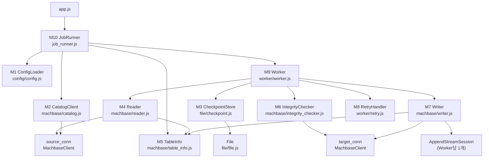
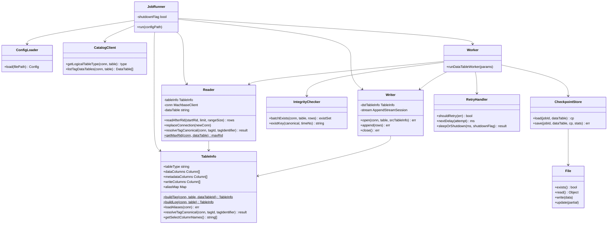
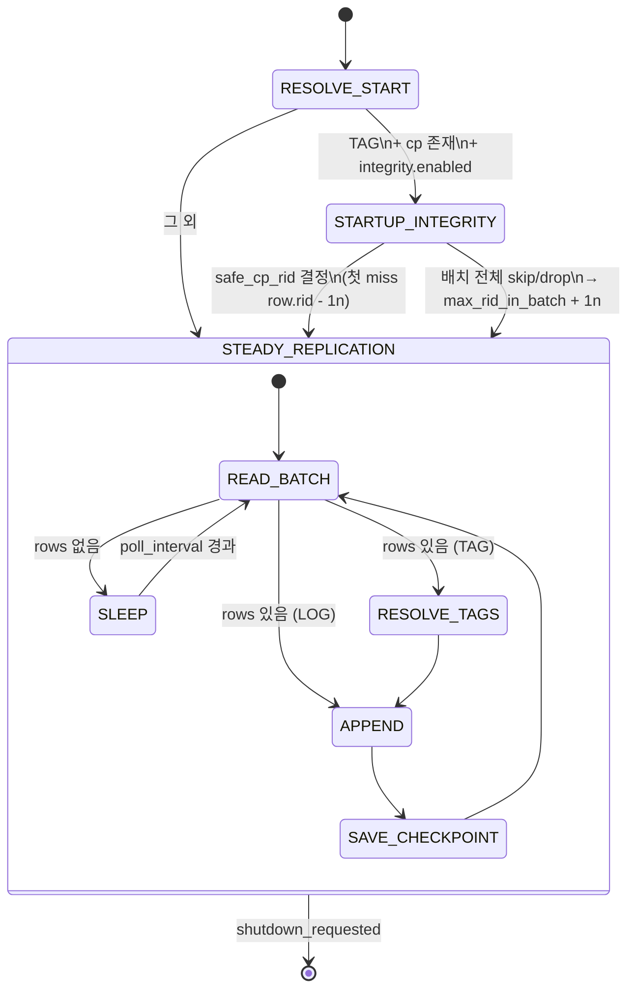
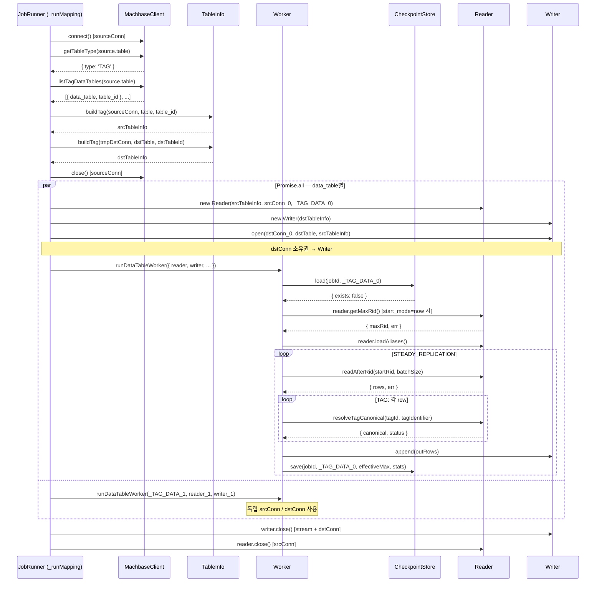

# repli-js 프로젝트 문서

**프로젝트**: Machbase TAG / Log 테이블 복제 도구
**런타임**: Node.js v22 (CommonJS)
**최종 수정**: 2026-02-27

---

## 목차

1. [프로젝트 개요](#1-프로젝트-개요)
2. [시스템 아키텍처](#2-시스템-아키텍처)
3. [설정 스키마](#3-설정-스키마)
4. [모듈 명세](#4-모듈-명세)
5. [핵심 동작 흐름](#5-핵심-동작-흐름)
6. [경계 조건 및 예외 시나리오](#6-경계-조건-및-예외-시나리오)
7. [에러 처리 정책](#7-에러-처리-정책)
8. [고정 정책 vs 설정 가능 항목](#8-고정-정책-vs-설정-가능-항목)
9. [테이블 타입별 동작 비교](#9-테이블-타입별-동작-비교)
10. [UML 다이어그램](#10-uml-다이어그램)
11. [확정 설계 결정 사항](#11-확정-설계-결정-사항)
12. [@machbase/ts-client 알려진 버그](#12-machbasets-client-알려진-버그)
13. [미결 사항 및 향후 과제](#13-미결-사항-및-향후-과제)

---

## 1. 프로젝트 개요

### 1.1 목적

원본 Database의 TAG / Log 테이블 데이터를 대상 Database 테이블로 지속 복제한다.
트랜잭션·PK가 없는 환경에서 `_rid` 기반 체크포인트를 활용하여 **at-least-once** 복제를 달성하고, 가능한 범위 내에서 정합성을 최대화한다.

### 1.2 목표 / 비목표

| 구분 | 항목 |
|------|------|
| **목표** | at-least-once 복제, 정합성 최대화 (Tag 테이블), Graceful Shutdown |
| **비목표** | Exactly-once 보장, Update/Delete 복제, 대상 테이블 생성/스키마 관리 |

### 1.3 핵심 제약

- DB 트랜잭션 없음, PK 없음 → 중복 발생 허용 (at-least-once)
- 복제 단위: `_rid` 기반 배치
- 설정 변경 시 프로세스 재시작 필요 (핫 리로드 미지원)

### 1.4 핵심 의존성

- `@machbase/ts-client@0.9.3` — CMI 프로토콜 기반 Machbase 네이티브 클라이언트

### 1.5 용어 정의

| 용어 | 정의 |
|------|------|
| 논리 테이블 | 원본 테이블. 실제 데이터를 저장하지 않고 메타 및 데이터 테이블 구성 정보만 보유 |
| 데이터 테이블 | 실제 데이터가 저장되는 테이블. Tag 테이블의 경우 `{logical}_DATA_{index}` 형태 |
| `_rid` | 데이터 테이블별 순차적이고 unique한 일련번호 (단조 증가) |
| 체크포인트 | 데이터 테이블별 마지막 성공 복제 `_rid` (파일로 저장) |
| canonical tag_name | tag_id → tag_name 변환 후 tag_identifier(prefix/suffix/none)를 적용한 최종 tag_name' |
| mapping | 하나의 소스 논리 테이블과 대상 테이블 간의 복제 단위 설정 |
| Worker | data_table 1개당 생성되는 독립 복제 실행 단위 |
| STARTUP_INTEGRITY | 재시작 직후 수행하는 중복 skip 및 시작 위치 보정 단계 (Tag 전용) |
| STEADY_REPLICATION | 정상 복제 루프 |
| effective_max | STEADY에서 checkpoint advance 기준이 되는 `_rid` 값 (max_written_rid 또는 max_rid_in_batch) |

---

## 2. 시스템 아키텍처

### 2.1 디렉토리 구조

```
repli-js/
├── app.js                      # 진입점 — ConfigLoader → JobRunner.run()
├── config.json                 # 설정 파일 (v3 스키마)
├── config/
│   └── config.js               # M1: ConfigLoader
├── machbase/
│   ├── machbase.js             # MachbaseClient, ColumnType, fixDoubleEndian()
│   ├── table_info.js           # M5: TableInfo (컬럼 메타 + TAG alias map)
│   ├── reader.js               # M4: Reader (RID 기반 소스 읽기, conn 소유)
│   ├── writer.js               # M7: Writer (appendOpen/append/close, conn 소유)
│   └── integrity_checker.js    # M6: IntegrityChecker
├── file/
│   ├── file.js                 # JSON 파일 읽기/쓰기 (atomic write, BigInt 지원)
│   └── checkpoint.js           # M3: CheckpointStore
├── worker/
│   ├── retry.js                # M8: RetryHandler
│   └── worker.js               # M9: Worker 상태 머신
├── job_runner.js               # Replicator, Job, Worker 클래스 (재시작 루프 포함)
├── tests/
│   ├── unit/
│   │   ├── checkpoint.test.js    # CheckpointStore 단위 테스트 (6개)
│   │   ├── config.test.js        # Config 단위 테스트 (26개)
│   │   ├── retry.test.js         # RetryHandler 단위 테스트 (19개)
│   │   ├── table_info.test.js    # TableInfo 단위 테스트 (16개)
│   │   ├── target_writer.test.js # Writer 단위 테스트 (6개)
│   │   ├── worker.test.js        # Worker 상태 머신 단위 테스트 (9개)
│   │   └── e2e_scenarios.test.js # E2E 시나리오 mock 테스트 (8개)
│   └── integration/
│       ├── tag_table.test.js     # TAG 테이블 통합 테스트 (8개)
│       ├── log_table.test.js     # LOG 테이블 통합 테스트 (10개)
│       └── log_schema.test.js    # LOG 스키마 변형 통합 테스트 (5개)
├── docs/
│   ├── PROJECT.md               # 본 문서
│   ├── ENDIAN_BUG.md            # @machbase/ts-client endian 버그 상세 분석
│   └── INTEGRATION_TESTS.md     # 통합 테스트 케이스별 결과 문서
└── package.json
```

### 2.2 컴포넌트 구성

```
┌──────────────────────────────────────────────────────────────┐
│  Main Process                                                │
│                                                              │
│  app.js → ConfigLoader → new Replicator(config).run()        │
│                              │                               │
│           Replicator         │                               │
│           ├─ Job (job당 1개, 독립 루프)                       │
│           │   ├─ _discoverMapping() — MachbaseClient(단기)   │
│           │   ├─ AbortController                              │
│           │   └─ Worker × N  (Promise.all, 병렬)             │
│           │       ├─ Reader (srcConn 소유) — 소스 DB 읽기    │
│           │       ├─ Writer (dstConn 소유) — 대상 DB 쓰기    │
│           │       └─ runDataTableWorker() — 상태 머신        │
│           └─ Job (다른 job — 독립 실행)                       │
└──────────────────────────────────────────────────────────────┘
```

### 2.3 Connection 관리 원칙 (설계 결정 B-01)

> **설계 번복 사유**: 통합 테스트 중 `@machbase/ts-client`가 단일 connection에서 동시 query 또는 append 호출 시 `"Unexpected protocol N, expected M"` 오류 발생 확인.

**확정 구조**: data_table(Worker)당 srcConn + dstConn 각 1개 생성

```
mapping (소스 table → 대상 table)
  [DISCOVER]  sourceConn: 1개  ── 타입/파티션 조회 후 close

  [Worker_0]  Reader(srcConn_0) + Writer(dstConn_0)  (appendOpen 포함)
  [Worker_1]  Reader(srcConn_1) + Writer(dstConn_1)  (appendOpen 포함)
  ...
  [Worker_N]  Reader(srcConn_N) + Writer(dstConn_N)  (appendOpen 포함)
```

- Reader가 srcConn을 소유, Writer가 dstConn을 소유 (close 책임도 각자)
- STARTUP_INTEGRITY에서 intConn(integrity 전용)은 배치마다 신규 생성 후 close
  - `@machbase/ts-client` 연결은 `end()` 후 재연결 불가 → 재사용 금지
  - statement ID 서버 한도(1024개/connection) 초과 방지

### 2.4 Machbase TAG 테이블 내부 구조

| 시스템 테이블 | 역할 |
|--------------|------|
| `_TAG_META` | 태그 메타 정보 (태그 이름 → `_ID` 매핑) |
| `_TAG_DATA_0` ~ `_TAG_DATA_N` | 실제 데이터 파티션 |
| `V$STORAGE_TAG_TABLES` | 파티션별 RID 범위 등 스토리지 정보 |
| `M$SYS_TABLES` / `M$SYS_COLUMNS` | 시스템 카탈로그 |

### 2.5 시스템 상태 머신

**Replicator 레벨**
```
start → [Job × N 병렬] → SIGTERM/SIGINT → graceful shutdown → exit
```

**Job 레벨 (job당 1개, 독립 루프)**
```
while(!shutdown):
  DISCOVER → Workers 병렬 실행 → (에러 → AbortController 전체 취소) → 재시작
```

**Worker 레벨 (data_table 1개당)**
```
RESOLVE_START → (STARTUP_INTEGRITY, TAG+체크포인트 존재 시) → STEADY_REPLICATION
```

---

## 3. 설정 스키마

### 3.1 최상위

| 필드 | 타입 | 필수 | 설명 |
|------|------|------|------|
| version | int | ✅ | 3 고정 |
| servers | map\<string, ServerConfig\> | ✅ | 서버 별칭 → 접속 정보 |
| replication.jobs | Job[] | ✅ | 복제 작업 목록 |

### 3.2 ServerConfig

```js
{
  host: string,
  port: number,
  user: string,
  password: string,
  database?: string,
  timezone?: string,
}
```

### 3.3 Job

| 필드 | 타입 | 기본값 | 설명 |
|------|------|--------|------|
| job_id | string | — | 고유 식별자 |
| enabled | bool | — | 실행 여부 |
| shutdown_timeout_ms | int | 30000 | Worker 종료 대기 타임아웃 (ms) |
| checkpoint.directory | string | — | 체크포인트 파일 저장 경로 |
| checkpoint.on_save_failure | "continue"\|"abort" | "continue" | 저장 실패 정책 |
| integrity.enabled | bool | — | 재시작 정합성 유지 여부 |
| integrity.mode | "existence_only" | — | 정합성 비교 방식 (현재 고정) |
| retry.enabled | bool | — | 재시도 활성화 |
| retry.strategy | "exponential"\|"linear" | — | 대기 증가 방식 |
| retry.initial_delay_ms | int | — | 최초 재시도 대기 (ms) |
| retry.max_delay_ms | int | — | 최대 재시도 대기 (ms) |
| retry.multiplier | float | — | 지수 증가 계수 |
| retry.jitter | bool | — | 랜덤 변동 적용 |
| retry.max_attempts | int\|null | null | 최대 횟수 (null = 무한) |
| execution_defaults.query_limit | int | 5000 | 배치당 최대 레코드 수 |
| execution_defaults.poll_interval_ms | int | — | 폴링 주기 (ms) |
| logging.level | "debug"\|"info"\|"warn"\|"error" | — | 로그 레벨 |
| logging.log_dir | string | — | 로그 파일 경로 |

### 3.4 Mapping

| 필드 | 타입 | 설명 |
|------|------|------|
| mapping_id | string | 고유 식별자 |
| source.server | string | servers 별칭 참조 |
| source.table | string | 원본 논리 테이블명 |
| source.columns | string[]\|null | SELECT 허용 컬럼 목록. null이면 전체 컬럼. 대소문자 무관(UPPERCASE 정규화). |
| source.start_mode | "full"\|"now"\|"rid_after" | 최초 실행 시작 기준 |
| source.rid_after | int\|null | start_mode=rid_after 시 기준 rid |
| source.tag_identifier.mode | "prefix"\|"suffix"\|"none" | tag name 식별자 방식 |
| source.tag_identifier.value | string | 적용 문자열 (구분자 포함) |
| source.execution | ExecutionOptions | source 레벨 실행 옵션 override |
| target.server | string | servers 별칭 참조 |
| target.table | string | 대상 테이블명 (사전 생성 필요) |
| execution | ExecutionOptions | mapping 레벨 실행 옵션 override (최우선) |

### 3.5 execution 필드 레벨 merge 규칙

각 필드(`query_limit`, `poll_interval_ms`)는 **독립적으로** 다음 우선순위를 따른다:
```
1순위: mapping.execution.{field}
2순위: source.execution.{field}
3순위: job.execution_defaults.{field}
```

### 3.6 체크포인트 파일 포맷

**파일명**: `{checkpoint.directory}/{job_id}__{data_table}.json`

```json
{
  "version": 1,
  "job_id": "<string>",
  "source": {
    "server": "<server_alias>",
    "table": "<logical_table>",
    "data_table": "<data_table_name>"
  },
  "checkpoint": {
    "last_success_rid": "<BigInt as string>",
    "updated_at": "<RFC3339>"
  }
}
```

---

## 4. 모듈 명세

### M1. ConfigLoader (`config/config.js`)

```js
ConfigLoader.load(filePath) → Config
```

**구현 항목**
- JSON.parse로 파일 읽기
- 필수 필드 검증: version==3, servers, replication.jobs
- servers 별칭 참조 유효성 (source.server, target.server가 servers에 존재)
- start_mode 값 범위: "full" | "now" | "rid_after"
- rid_after: start_mode=="rid_after"일 때 필수
- on_save_failure: "continue" | "abort" (기본값: "continue")
- shutdown_timeout_ms: 양의 정수 (기본값: 30000)
- query_limit 기본값: 5000
- execution 필드 레벨 merge: mapping > source > job (필드 독립 적용)
- `source.columns` 검증 및 정규화:
  - `null`/`undefined` → `columns: null` (전체 컬럼)
  - 비어있지 않은 문자열 배열 → UPPERCASE 정규화 후 `mapping.source.columns`에 저장
  - 빈 배열 또는 비문자열 항목 → `level="error"` 로그 + 해당 mapping 스킵

---

### M2. MachbaseClient 카탈로그 메서드 (`machbase/machbase.js`)

CatalogClient는 삭제되었으며, 카탈로그 기능은 `MachbaseClient`에 통합되었다.

```js
conn.getTableType(table) → { type: "TAG"|"LOG"|"UNSUPPORTED" }
conn.listTagDataTables(logicalTable) → [{ data_table, table_id }]
```

**구현 항목**
- `getTableType`: `M$SYS_TABLES.TYPE` — 6=TAG, 0=LOG, 그 외=UNSUPPORTED
- `listTagDataTables`: `V$STORAGE_TAG_TABLES + M$SYS_TABLES` 조인으로 파티션 목록 조회
  - `table_id`는 `Number()` 변환하여 반환 (BigInt 직렬화 오류 방지)
- JobRunner의 DISCOVER 단계에서 호출, 결과를 기반으로 Worker 생성

---

### M3. CheckpointStore (`file/checkpoint.js`)

```js
CheckpointStore.load(jobId, dataTable) → { cp, exists, err }
CheckpointStore.save(jobId, dataTable, cp, stats) → err
```

**구현 항목**
- `File` 클래스를 기반으로 atomic write 활용 (tmp 파일 → rename)
- 파일 없음 → `{ exists: false, err: null }`
- JSON 파싱 실패 → `{ exists: false, err: ... }` + stage="checkpoint_io" 로그
- `source.data_table` ≠ 파일명 내 data_table → 손상 처리, 무효화
- `on_save_failure="continue"`: 오류 로그 + Worker 메모리 기준 rid로 계속
- `on_save_failure="abort"`: TODO (현재 continue와 동일하게 동작)
- 저장 성공 시 `checkpoint_saved` 구조화 로그 출력 (stats 4개 필드 포함)

---

### M4. Reader (`machbase/reader.js`)

```js
reader = new Reader(tableInfo, conn, dataTable, sourceColumns = null)

// conn 관리
reader.close()                    // 소유한 conn 닫기
reader.refreshConnection(config)  // 새 MachbaseClient 생성 후 기존 conn 교체

// TableInfo 위임
reader.aliasMap                   // → tableInfo.aliasMap
reader.loadAliases()              // → tableInfo.loadAliases(this.conn)
reader.resolveTagCanonical(tagId, tagIdentifier)  // → tableInfo.resolveTagCanonical(this.conn, ...)

// 읽기
reader.readAfterRid(startRid, limit, rangeSize) → { rows, err }
reader.getMaxRid()                // 인스턴스 메서드 (static 아님)
```

**`sourceColumns` 파라미터**
- `null` (기본값): `schema.getSelectColumnNames(null)` → 전체 dataColumns SELECT
- `string[]` (UPPERCASE): `schema.getSelectColumnNames(sourceColumns)` → 허용 컬럼만 SELECT
- config에서 `mapping.source.columns`를 그대로 전달 (JobRunner가 주입)

**SQL (설계 결정 D-01)**
```sql
-- 1. endRid 결정
SELECT MAX(_RID) as max_rid FROM data_table

-- 2. 데이터 읽기 (sourceColumns=["TIME"]인 경우)
SELECT /*+ RID_RANGE(data_table, startRid, endRid) */
       _RID, name, time
FROM   data_table
WHERE  _RID >= startRid
LIMIT  limit
```

- `endRid` = `MAX(_RID) + 1n` 실제 조회값 (RID 희소성 대응, 배치당 2 statement 소비)
- `name` 컬럼은 정수 tag_id 그대로 반환 → `resolveTagCanonical()`이 이름으로 변환
- Row 구조: `{ rid: BigInt, tagId: any, data: { TIME, VALUE, ... } }` (UPPERCASE key)
- `getMaxRid()` 빈 테이블 → `0n` 반환 / 오류 → `{ maxRid: 0n, err }` 반환
- SELECT 컬럼은 `tableInfo.getSelectColumnNames(this.sourceColumns)`에서 동적 결정

---

### M5. TableSchema / TagAliasCache (`machbase/table_info.js`)

```js
// ── TableSchema (불변 컬럼 구조) ──
TableSchema.buildTag(conn, logicalTable, dataTableId) → Promise<TableSchema>
TableSchema.buildLog(conn, logicalTable) → Promise<TableSchema>

// 인스턴스 속성
schema.tableType         // 'TAG' | 'LOG'
schema.logicalTable      // 논리 테이블명
schema.dataColumns       // SELECT용 데이터 컬럼
schema.metadataColumns   // metadata 컬럼 (TAG 전용)
schema.writeColumns      // appendOpen용 전체 컬럼 (NAME + data + metadata)

// 인스턴스 메서드
schema.getSelectColumnNames(allowedColumns = null) → string[]
  // allowedColumns: UPPERCASE string[] | null
  // null → 전체 dataColumns 반환 (lowercase)
  // string[] → allowedColumns에 포함된 dataColumns만 반환 (lowercase)

// ── TagAliasCache (동적 TAG alias 상태) ──
new TagAliasCache(logicalTable)
cache.load(conn) → Error|null
cache.resolve(conn, tagId, tagIdentifier)
  → { canonical: string|null, status: "ok"|"drop_not_found"|"retry_error" }
cache.size  // 현재 캐시 항목 수
```

**구현 항목**

`TableSchema.buildTag()` — TAG 테이블 컬럼 분석
- Step 1: _{table}_META 컬럼 조회 → metadata columns 추출
- Step 2: _{table}_DATA_{id} 컬럼 조회 → data columns 추출 (NAME/_ prefix 컬럼 제외)
- Step 3: writeColumns = [NAME(varchar)] + dataColumns + metadataColumns
- alias map 로드는 포함하지 않음 (TagAliasCache 책임)

`TableSchema.buildLog()` — LOG 테이블 컬럼 분석
- M$SYS_COLUMNS에서 전체 컬럼 조회
- dataColumns = writeColumns (metadata 없음)

`TableSchema.getSelectColumnNames(allowedColumns = null)` — SELECT 컬럼 결정
- `allowedColumns === null`: 전체 dataColumns → lowercase 변환
- `allowedColumns` (UPPERCASE string[]): 해당 컬럼명이 dataColumns에 있는 것만 필터링 → lowercase 변환
- allowlist에 없는 컬럼은 조용히 무시 (에러 없음)

`TagAliasCache.resolve()` — Read-through cache (설계 결정 D-02)
- `_map`에서 tagId 조회 → 있으면 tag_identifier 적용 후 반환 (`status: "ok"`)
- Map miss → `_LOGICAL_META`에서 단건 DB 조회 → Map에 추가 후 반환
- DB 조회 후에도 없음 → `status: "drop_not_found"` (해당 row drop)
- DB 오류 → `status: "retry_error"` (retry 대상)

**tag_identifier 적용**
```
mode == "prefix" → value + tag_name
mode == "suffix" → tag_name + value
mode == "none"   → tag_name
```

**주의**: Map 키 타입 정규화 — `_ID`는 BigInt이므로 tagId를 `BigInt(tagId)`로 정규화 후 조회

---

### M6. IntegrityChecker (`machbase/integrity_checker.js`)

```js
IntegrityChecker.existsByTagAndTime(conn, table, canonicalTag, timeNs)
  → { exists: bool, err }
IntegrityChecker.batchExists(conn, table, rows)
  → { existSet: Set<string>, err }
IntegrityChecker.existKey(canonical, timeNs)
  → string
```

**구현 항목**
- `batchExists`: 배치 단위 일괄 존재 확인 (STARTUP_INTEGRITY에서 실제 사용)
  - OR 조건으로 단일 쿼리 실행 → statement ID 1회만 소비
  - 배치 크기: 최대 500행 (`integrityBatchSize = min(query_limit, 500)`)
  - 반환: `Set<"canonical\x00time">` (존재하는 행만 포함)
- 인라인 이스케이프 방식 (`'` → `''`) 사용 — @machbase/ts-client 파라미터 바인딩은 내부적으로 PREPARE → statement ID 소비하므로 직접 보간
- `existKey`: existSet 조회를 위한 복합 키 생성 헬퍼
- STARTUP_INTEGRITY 단계에서만 사용 (STEADY 중 미사용, 고정 정책)

---

### M7. Writer (`machbase/writer.js`)

```js
writer = new Writer(dstTableInfo)
writer.open(conn, table, srcTableInfo) → Error|null   // conn 소유권 획득
writer.append(rows) → Error|null
writer.close() → Error|null                           // stream.close() + conn.close()
```

**구현 항목**
- Worker당 1개 인스턴스, dstTableInfo 소유
- `open(conn, table, srcTableInfo)`:
  - `this.conn = conn` — dstConn 소유권 이전
  - srcTableInfo.writeColumns 기준 Set → dstTableInfo.writeColumns 순회하여 `appendColumns` 구성
  - `isSourceColumn=true`: 소스에 있는 컬럼 → 실제 값 사용
  - `isSourceColumn=false`: 소스에 없는 대상 컬럼 → `ColumnType.safeNull` 패딩
  - `appendOpen()` 호출하여 `this.stream` 생성
- `append(rows)`:
  - rows의 키는 대문자 컬럼명 (`{ NAME, TIME, VALUE, ... }`)
  - `int64` 타입(`datetime`/`long`/`ulong`) → `BigInt()` 변환 필수
  - null 소스 값 → `ColumnType.safeNull` 대체
  - 2차원 배열 변환 후 `stream.append()` 호출
- `close()`: `stream.close()` → `conn.close()` 순서로 정리. 첫 번째 오류 반환

---

### M8. RetryHandler (`worker/retry.js`)

```js
RetryHandler.shouldRetry(err) → bool
RetryHandler.nextDelay(attempt) → ms
RetryHandler.sleepOrShutdown(ms, shutdownFlag) → Promise<"timeout"|"shutdown">
```

**구현 항목**
- strategy: "exponential" → `initial_delay_ms * multiplier^attempt`
- strategy: "linear" → `initial_delay_ms * (attempt + 1)`
- 계산값이 max_delay_ms 초과 시 max_delay_ms 적용
- jitter=true → `delay * Math.random()`
- max_attempts: null=무한, 초과 시 mapping 스킵
- 재시도 불가 오류(설정 오류, TAG 컬럼 규칙 위반, TYPE 불일치) → 즉시 스킵
- `sleepOrShutdown`: `Promise.race([setTimeout(ms), shutdownSignal])` 구현

---

### M9. Worker (`worker/worker.js`)

```js
runDataTableWorker({
  jobId, mapping, checkpoint, tableType, dataTable,
  srcConfig, dstConfig, reader, writer, shutdownFlag
}) → Promise<void>
```

**상태 전이**
```
RESOLVE_START → (STARTUP_INTEGRITY, TAG+cp존재+integrity.enabled) → STEADY_REPLICATION
```

**RESOLVE_START**
- `checkpointStore.load(jobId, dataTable)`
- cp 존재 → `startRid = cp.last_success_rid + 1n` (start_mode 무시)
- cp 없음/손상 → start_mode 기준: `full`=0n, `now`=`reader.getMaxRid() + 1n`, `rid_after`=설정값
- TAG 테이블: `reader.aliasMap.size === 0`이면 `reader.loadAliases()` 호출

**STARTUP_INTEGRITY_PHASE**
- 진입 조건: `tableType === 'TAG'` && `cpExists` && `exec.integrity?.enabled !== false`
- 배치마다 신규 `intConn = new MachbaseClient(dstConfig)` 생성 후 finally에서 close
- `_resolveCanonical()` → `IntegrityChecker.batchExists()` (단일 OR 쿼리, statement 1회 소비)
- 첫 번째 miss row 발견 → `safeCpRid = firstMissRid - 1n`, cp 저장, `startRid = firstMissRid`, STEADY 진입
- 배치 전체 skip/drop → `cp.last_success_rid = maxRidInBatch`, `integrityRid = maxRidInBatch + 1n`, 다음 배치
- 소스가 빈 배열 → `startRid = integrityRid`로 유지하고 STEADY 진입

**STEADY_REPLICATION_LOOP**
```
stmtCount = 0  (배치당 2 statement 소비 — MAX + SELECT)

while NOT shutdown_requested:
  if stmtCount >= 900: reader.refreshConnection(srcConfig); stmtCount = 0

  rows = _readBatch(reader, startRid, batchSize, ...)  [retry 포함]
  stmtCount += 2
  if rows.empty: sleepOrShutdown(poll_interval_ms); continue

  maxRidInBatch = MAX(rows.rid)

  [TAG] 각 row: _resolveCanonical() → drop 시 skip
        const { NAME: _drop, ...restData } = row.data  // 방어적 NAME 제거
        outRows.push({ NAME: canonical, ...restData })
  [LOG] outRows.push({ NAME: row.tagId, ...row.data })

  if outRows not empty:
    _appendRows(writer, outRows, ...)  [retry 포함]
    maxWrittenRid = MAX(outRids)

  effectiveMax = maxWrittenRid > 0n ? maxWrittenRid : maxRidInBatch
  checkpointStore.save(..., { last_success_rid: effectiveMax }, stats)
  startRid = effectiveMax + 1n
```

---

### JobRunner (`job_runner.js`)

함수 구조: `run(config)` → `_runJob(job, servers, shutdownFlag)` → `_runMapping(job, mapping, servers, shutdownFlag)`

**`_runMapping` 구현 항목**
1. DISCOVER — sourceConn 1개 생성:
   - `conn.getTableType()` → TAG / LOG / UNSUPPORTED
   - TAG: `conn.listTagDataTables()` → 파티션 목록, `TableInfo.buildTag()` (srcTableInfo/dstTableInfo)
   - LOG: `dataTables = [source.table]`, `TableInfo.buildLog()` (srcTableInfo/dstTableInfo)
   - dstTableInfo 빌드용 tmpDstConn은 빌드 후 즉시 close
2. sourceConn close
3. data_table마다 `Reader(srcConn, sourceColumns)` + `Writer(dstTableInfo)` 생성 → `writer.open(dstConn, ...)`
   - `mapping.source.columns`를 Reader 5번째 인수로 전달 (null이면 전체 컬럼)
   - setup(connect + open) 성공 시에만 `workerResources`에 push
   - setup 실패 시 해당 경로에서 `wDstConn` / `wSrcConn`을 직접 close 후 return
4. `Promise.all`로 Worker 병렬 실행, 각 Worker에 `{ srcConfig, dstConfig, reader, writer, ... }` 주입
5. `finally` 블록: `writer.close()` (stream + dstConn 포함) → `reader.close()` (srcConn 포함)
   - setup 실패한 Worker는 `workerResources`에 포함되지 않으므로 중복 close 없음

**Graceful Shutdown**
- SIGTERM / SIGINT → `shutdownFlag.value = true` + 타이머 시작
- `shutdown_timeout_ms` 초과 → `level="warn"` 로그 + `process.exit(1)`
- 정상 종료 시 `clearTimeout(timeoutHandle)` 호출 (Node.js 블록 방지)

---

### @machbase/ts-client API 참조

`createConnection(config)` → `Connection` 객체 반환.

| 메서드 | 시그니처 | 설명 |
|--------|----------|------|
| `connect()` | `() → Promise<void>` | DB 연결 |
| `end()` | `() → Promise<void>` | 연결 종료 |
| `query()` | `(sql, values?) → Promise<[rows, fields]>` | SQL 쿼리 실행 |
| `execute()` | `(sql, values?) → Promise<[result, fields]>` | SQL 실행 |
| `appendOpen()` | `(table, columns, options?) → Promise<AppendStreamSession>` | Append 스트림 오픈 |

**컬럼 타입 매핑**

| Machbase 내부 타입 코드 | 이름 |
|------------------------|------|
| 4 / 104 | short / ushort |
| 8 / 108 | integer / uinteger |
| 12 / 112 | long / ulong |
| 16 | float |
| 20 | double |
| 5 | varchar |
| 49 | text |
| 6 | datetime |
| 61 | json |

---

## 5. 핵심 동작 흐름

### 5.1 초기화 흐름

```
1. ConfigLoader.load()
2. enabled == true인 job 선택
3. 각 job의 mapping에 대해 DISCOVER (CatalogClient):
   a. 테이블 TYPE 조회
   b. TAG이면 데이터 테이블 목록 조회 + 컬럼 규칙 검증
   c. Log이면 n:1 매핑 검증
   d. 오류 시 해당 mapping 스킵 (job은 계속)
4. data_table마다 독립 srcConn + dstConn + TargetWriter 생성
5. data_table별 Worker를 Promise.all로 병렬 실행
6. SIGTERM 수신 대기
```

### 5.2 Worker 시작점 결정 (RESOLVE_START)

```
1. CheckpointStore.load()
2. 체크포인트 존재 & 파싱 성공:
   start_rid = cp.last_success_rid  (start_mode 무시, 고정 정책)
3. 체크포인트 없음/손상:
   - full     → start_rid = 0n
   - now      → start_rid = SourceReader.getMaxRid()
   - rid_after → start_rid = config.rid_after
4. (TAG + 체크포인트 존재 + integrity.enabled) 이면:
   start_rid = STARTUP_INTEGRITY_PHASE(start_rid)
5. STEADY_REPLICATION_LOOP(start_rid)
```

### 5.3 STARTUP_INTEGRITY_PHASE (Tag 전용)

```
while NOT shutdown_requested:
  rows = readAfterRid(start_rid, batch_size)
  if empty: SLEEP_OR_SHUTDOWN; continue

  max_rid_in_batch = MAX(rows.rid)
  intConn = new MachbaseClient(dstConfig)  // 배치마다 신규 생성

  for row in rows:
    (canonical, status) = resolveTagCanonical(row.tag_id)
    if status == retry_error: retry
    if status == drop_not_found: stats.dropped++; continue

    key = existKey(canonical, row.time)
    if batchExists.has(key): stats.skipped++; continue

    // 최초 miss 발견
    safe_cp_rid = row.rid - 1n
    SAVE_CHECKPOINT(safe_cp_rid)
    intConn.close()
    return safe_cp_rid   // STEADY는 이 rid부터 시작

  // 배치 전체 skip/drop
  intConn.close()
  SAVE_CHECKPOINT(max_rid_in_batch + 1n)
  start_rid = max_rid_in_batch + 1n
```

### 5.4 STEADY_REPLICATION_LOOP

```
while NOT shutdown_requested:
  rows = readAfterRid(start_rid, batch_size)
  if empty: SLEEP_OR_SHUTDOWN(poll_interval_ms); continue

  max_rid_in_batch = MAX(rows.rid)
  max_written_rid  = 0n

  [TAG] rows → resolveTagCanonical → canonical tag_name' 치환 → out_rows
  [LOG] out_rows = rows 그대로

  if out_rows is not empty:
    write(out_rows)
    if error: retry → continue
    max_written_rid = MAX(out_rows.rid)

  // checkpoint 갱신 (F-01 반영)
  effective_max = max_written_rid > 0n ? max_written_rid : max_rid_in_batch
  SAVE_CHECKPOINT(effective_max + 1n)
  start_rid = effective_max + 1n
```

> **핵심**: `effective_max + 1n`을 저장함으로써 재시작 시 중복 없이 다음 미처리 RID부터 읽는다.
> `max_written_rid = 0n` (전부 drop)인 경우 `max_rid_in_batch`를 fallback으로 사용한다.

### 5.5 Graceful Shutdown

```
[메인 프로세스]
SIGTERM 수신
  → shutdownFlag.value = true
  → 모든 Worker 종료 대기 (최대 shutdown_timeout_ms ms)
  → 타임아웃 초과 시 강제 종료 + level="warn" 경고 로그

[Worker]
  → 배치 루프 시작 시 shutdownFlag 확인
  → true이면 루프 탈출 (진행 중 배치는 완료 후 종료)
  → SLEEP 중에도 즉시 깨어남
```

---

## 6. 경계 조건 및 예외 시나리오

### 6.1 체크포인트 파일 상태별 처리

| 상태 | 처리 동작 |
|------|-----------|
| 파일 없음 | `exists=false`, `err=null` → start_mode 기준으로 시작점 결정 |
| 파일 있음, 파싱 성공, data_table 일치 | `exists=true`, cp 반환 → `cp.last_success_rid` 기준으로 시작 |
| 파일 있음, JSON 파싱 실패 | `exists=false`, `err=parseError` + stage="checkpoint_io" 오류 로그 → "없음"으로 취급 |
| 파일 있음, `source.data_table` 불일치 | `exists=false`, `err=corruptionError` + "data_table mismatch" 오류 로그 → "없음"으로 취급 |
| `.tmp` 파일만 남아 있음 | `.tmp` 파일 무시, `.json` 파일 기준으로 처리 |

### 6.2 start_mode별 시작점 결정 (체크포인트 없음 시)

| start_mode | 시작점 결정 로직 | 엣지 케이스 |
|------------|-----------------|-------------|
| full | `start_rid = 0n` | 데이터 없어도 0n으로 시작, 즉시 빈 배열 반환 후 폴링 |
| now | `start_rid = SourceReader.getMaxRid()` | 빈 테이블이면 0n 반환, 이후 새 데이터부터 복제 |
| rid_after | `start_rid = mapping.source.rid_after` (BigInt) | rid_after가 실제 max_rid보다 크면 빈 배열 반환 후 폴링 |

**공통 규칙**: 체크포인트가 존재하면 start_mode는 무조건 무시된다 (고정 정책).

### 6.3 STARTUP_INTEGRITY 배치 전체 skip/drop 발생 시

- 배치 내 모든 row가 `skipped_exists` 또는 `dropped_no_meta`인 경우
- `SAVE_CHECKPOINT(max_rid_in_batch + 1n)` → `start_rid = max_rid_in_batch + 1n`
- 다음 배치 읽기 계속 (STARTUP_INTEGRITY 루프 유지)

### 6.4 STEADY_REPLICATION all-drop 발생 시 (F-01)

- TAG 테이블에서 배치 내 모든 row가 `drop_not_found`로 처리된 경우 (`out_rows` 비어있음)
- `effective_max = max_rid_in_batch` (fallback)
- `SAVE_CHECKPOINT(max_rid_in_batch + 1n)`
- write하지 않아도 배치는 "처리 완료"로 간주하여 체크포인트를 전진시킨다.

### 6.5 Graceful Shutdown 처리

| 시나리오 | 처리 동작 |
|----------|-----------|
| SIGTERM 수신, Worker들이 SLEEP 중 | 각 Worker가 SLEEP에서 즉시 깨어나 루프 탈출 → 체크포인트 저장 후 종료 |
| SIGTERM 수신, Worker가 배치 처리 중 | 현재 배치 완료 + 체크포인트 저장 후 루프 탈출 |
| `shutdown_timeout_ms` 이내 전체 종료 | 정상 종료 로그 출력 |
| `shutdown_timeout_ms` 초과, 일부 Worker 미종료 | `level="warn"` 경고 로그 + 강제 종료 (중복 허용 범위) |

### 6.6 체크포인트 저장 실패 처리

| `on_save_failure` | 처리 동작 |
|-------------------|-----------|
| `"continue"` (기본값) | `level="error"` 로그 출력. Worker는 메모리 기준 rid로 계속 처리. 다음 재시작 시 중복 증가 가능 |
| `"abort"` | TODO — 현재 `"continue"`와 동일하게 동작 + TODO 경고 로그 출력 |

### 6.7 스키마 불일치 처리 정책

| 불일치 유형 | 처리 |
|------------|------|
| 원본에 있고 대상에 없는 컬럼 | 해당 컬럼 값을 write에서 제외 (무시) |
| 대상에 있고 원본에 없는 컬럼 | Null로 채움 |

---

## 7. 에러 처리 정책

| 오류 유형 | 발생 단계 | 처리 |
|-----------|-----------|------|
| 설정 오류 (잘못된 값, 참조 오류) | INIT | mapping 스킵 |
| TAG 컬럼 규칙 위반 | DISCOVER | mapping 스킵 |
| TYPE 불일치 / 미지원 | DISCOVER | mapping 스킵 |
| 카탈로그 조회 실패 | DISCOVER | mapping 스킵 |
| 체크포인트 파싱 실패 | RESOLVE_START | "없음" 취급 + 로그 |
| 체크포인트 저장 실패 | SAVE_CHECKPOINT | on_save_failure 정책 적용 |
| 소스 읽기 오류 (네트워크) | READ | retry |
| tag_id 메타 조회 오류 (not found) | META_LOOKUP | row drop |
| tag_id 메타 조회 오류 (일시) | META_LOOKUP | retry |
| 존재 여부 검색 오류 | INTEGRITY_CHECK | retry |
| 대상 쓰기 오류 (네트워크) | WRITE | retry |
| 재시도 횟수 초과 (max_attempts 도달) | 각 단계 | mapping 스킵 |

**재시도 불가 오류 (즉시 mapping 스킵)**
- 설정 오류, TAG 컬럼 규칙 위반, 테이블 TYPE 불일치, 대상 테이블 미존재

**구조화 로그 필수 포함 정보**
```json
{
  "stage": "catalog | checkpoint_io | read | meta_lookup | integrity_check | write",
  "job_id": "<string>",
  "mapping_id": "<string>",
  "data_table": "<string>",
  "raw": "<원본 에러 메시지>"
}
```

**체크포인트 저장 성공 시 로그 (`checkpoint_saved`)**
```json
{
  "level": "info",
  "stage": "checkpoint_saved",
  "job_id": "<string>",
  "data_table": "<string>",
  "last_success_rid": "<BigInt as string>",
  "rows_read": 0,
  "rows_written": 0,
  "dropped_no_meta": 0,
  "skipped_exists": 0
}
```

---

## 8. 고정 정책 vs 설정 가능 항목

### 8.1 고정 정책 (설정 파일에 노출되지 않음)

| 항목 | 고정값 | 설명 |
|------|--------|------|
| `max_inflight_batches` | 1 | 1 Worker당 동시 처리 배치 1개 |
| `single_instance_per_data_table` | true | 1 data_table = 1 Worker, 중복 실행 없음 |
| `atomic_write` | true | 체크포인트 파일은 항상 tmp → rename |
| `skip_when_table_type_unsupported` | true | 미지원 TYPE은 mapping 단위로 스킵 |
| `config_hot_reload` | false | 설정 변경 시 프로세스 재시작 필요 |
| `integrity.mode` | `"existence_only"` | tag_name+time 존재 여부만 확인 |
| `tag_column_position` | 1번째=tag, 2번째=time | Tag 테이블 컬럼 규칙, 설정으로 변경 불가 |
| `startup_integrity_scope` | 재시작 직후 보정 구간만 | STEADY 중 존재 여부 검색 수행 안 함 |

---

## 9. 테이블 타입별 동작 비교

| 항목 | Tag 테이블 (TYPE=6) | Log 테이블 (TYPE=0) |
|------|--------------------|--------------------|
| 논리/데이터 구조 | 논리 테이블 ≠ 데이터 테이블 (1:N) | 논리 테이블 = 데이터 테이블 (1:1) |
| data_table 목록 조회 | `V$STORAGE_TAG_TABLES`에서 조회 | `[source.table]` 1개 고정 |
| 컬럼 규칙 검증 | 1번째=tag id(integer), 2번째=time(int64) 검증 | 검증 없음 |
| 매핑 제한 | 1:1, 1:n, n:m 모두 허용 | 1:1만 허용 (n:1 금지) |
| tag_id → canonical 변환 | 수행 (resolveTagCanonical) | 수행하지 않음 |
| tag_identifier 적용 | 적용 (prefix/suffix/none) | 적용하지 않음 |
| STARTUP_INTEGRITY 수행 | 체크포인트 있고 integrity.enabled=true 시 수행 | 수행하지 않음 |
| 재시작 중복 방지 | 가능 (tag_name + time 존재 여부 확인) | 불가능 (의도적 허용) |
| drop_not_found 처리 | tag_id 메타 없으면 row drop, cp 전진 | 해당 없음 |
| stats.skipped_exists 발생 | STARTUP_INTEGRITY에서만 발생 | 발생하지 않음 |
| checkpoint advance (all-drop) | `max_rid_in_batch + 1n` (fallback) | 해당 없음 |

---

## 10. UML 다이어그램

### 10.1 컴포넌트 다이어그램 — 모듈 의존 관계



### 10.2 클래스 다이어그램



### 10.3 Worker 상태 머신



### 10.4 시퀀스 다이어그램 — 메인 복제 흐름



---

## 11. 확정 설계 결정 사항

| ID | 항목 | 결정 |
|----|------|------|
| B-01 | target connection / stream 공유 방식 | **Worker(data_table)당 독립** srcConn(Reader 소유) + dstConn(Writer 소유) 생성 |
| B-02 | `on_save_failure="abort"` 동작 | 코드 상 TODO 주석으로 남김. 현재는 "continue"와 동일하게 동작 |
| B-03 | 설정 파일 형식 | JSON 채택 |
| D-01 | SourceReader SQL 방식 | RID_RANGE 힌트 + `_RID >= startRid` 조건 병용. endRid는 `MAX(_RID)` 실제 조회값 |
| D-02 | TagMetaProvider 메타 로드 방식 | Read-through cache. Worker 시작 시 전체 로드, miss 시 단건 DB 조회 |
| D-03 | `getMaxRid()` 실패 시 처리 | SKIP_MAPPING (worker 즉시 return) |
| D-04 | Reader/Writer conn 소유 방식 | Reader가 srcConn 소유·close, Writer가 dstConn 소유·close. setup 실패 시 JobRunner가 해당 경로에서 직접 close |
| B-04 | Job 재시작 전략 | Worker 하나라도 에러 시 AbortController로 전체 취소 → while(!shutdown) 루프로 Job 전체 재시작. job 독립(다른 job에 영향 없음) |
| B-05 | AbortSignal → shutdownFlag 연동 | Worker.run()은 `signal.aborted || shutdownFlag.value` proxy 객체를 runDataTableWorker에 전달하여 abort 시 STEADY 루프 즉시 탈출 |
| — | STARTUP_INTEGRITY retry 시 배치 재처리 범위 | 배치 내 이미 처리한 row는 건너뜀, 실패 row부터 재처리 |
| — | Statement ID 고갈 대응 (STEADY) | stmtCount 추적, 900 도달 시 `reader.refreshConnection(srcConfig)` 호출 |

---

## 12. @machbase/ts-client 알려진 버그

#### 버그: FLOAT/DOUBLE 쿼리 결과 endian 오류

- **버전**: `@machbase/ts-client@0.9.3`
- **위치**: `node_modules/@machbase/ts-client/dist/connection.js`, `decodeFixedField()` 함수 (1164~1167줄)

**원인**

`decodeFixedField()`는 쿼리 결과 행의 고정 길이 필드를 디코딩하는 standalone 함수다. 정수 계열(`INT16`~`INT64`, `UINT16`~`UINT64`, `DATETIME`)은 Big-Endian(`readInt16BE` 등)으로 읽고, 부동소수점 계열(`FLT32`, `FLT64`)은 **Little-Endian**(`readFloatLE`, `readDoubleLE`)으로 읽도록 하드코딩되어 있다.

```js
// connection.js:1164-1167 (버그 있는 원본 코드)
case CMD_FLT32_TYPE:
    return field.readFloatLE(0);   // ← 항상 LE
case CMD_FLT64_TYPE:
    return field.readDoubleLE(0);  // ← 항상 LE
```

그러나 Machbase 서버의 TAG 데이터 파티션은 **파티션 인덱스(DATA_0, DATA_1, …)에 따라 DOUBLE 값을 BE 또는 LE로 저장**한다. 서버가 BE로 저장한 값을 클라이언트가 LE로 읽으면, IEEE 754 상 지수부가 0에 가까운 극소값(denormal)으로 해석된다.

**예시**

| 실제 값 | BE 저장 바이트 | LE로 잘못 읽은 결과 |
|---------|---------------|-------------------|
| `3200.0` | `40 A9 00 00 00 00 00 00` | `2.1407e-319` |
| `85.0`   | `40 55 40 00 00 00 00 00` | `2.083044e-317` |
| `1.1`    | `3F F1 99 99 99 99 99 9A` | `1.1` (DATA_1: LE 저장이므로 정상) |

연결 핸드셰이크에서 `serverEndian = 0`(LE)으로 기록하지만(`429~438줄`), `decodeFixedField()`는 `serverEndian`을 받는 파라미터가 없어 이 정보를 사용할 수 없다.

**우회 구현**

BE로 저장된 값을 LE로 잘못 읽으면 반드시 **denormal**(비정규 부동소수점, `0 < |v| < 2.2250738585072014e-308`)이 된다. 반대로 실측 센서값이 우연히 denormal 범위에 들어오는 경우는 실무상 없으므로, `machbase/machbase.js`의 `fixDoubleEndian()` 함수에서 다음과 같이 사후 보정한다. 상세 분석은 [ENDIAN_BUG.md](./ENDIAN_BUG.md) 참고.

```js
// machbase/machbase.js — fixDoubleEndian()
if (v !== 0 && Math.abs(v) < DOUBLE_MIN_NORMAL) {
    _fixBuf.writeDoubleLE(v, 0);
    row[key] = _fixBuf.readDoubleBE(0);  // 바이트 순서 뒤집어 재해석
}
```

`MachbaseClient.query()` 반환 직전에 모든 row에 대해 이 보정을 적용한다. 라이브러리를 `npm install`로 재설치해도 프로젝트 코드 내에 우회 로직이 있으므로 재발하지 않는다.

---

## 13. 미결 사항 및 향후 과제

### 12.1 미결 사항

| ID | 항목 | 현황 |
|----|------|------|
| B-02 | `on_save_failure="abort"` 세부 동작 | 코드 TODO 주석, 구현 유보 (현재 continue와 동일) |
| — | STARTUP_INTEGRITY 대용량 데이터 성능 | checkpoint 이후 모든 row를 순차 확인하므로 데이터량 비례 시간 소요. 향후 "최근 N개 row만 확인" 방식으로 개선 검토 필요 |

### 12.2 향후 과제 (비범위)

| 항목 | 상태 | 비고 |
|------|------|------|
| 메타 정보 동기화 루틴 | 미정의 | 별도 설계 예정 |
| 상태 조회 API / Prometheus 메트릭 | Backlog | 1차는 구조화 로그로 대체 |
| Log 테이블 `_arrival_time` 전달 옵션 | Backlog | `log.include_arrival_time` (기본 false) |
| Log 테이블 tag_identifier 확장 | Backlog | `log.identifier_columns` |
| Log 테이블 재시작 정합성 옵션 | Backlog | `log.integrity.key_columns` |

### 12.3 실행 방법

```bash
node app.js
# 또는 설정 파일 경로 직접 지정
node app.js /path/to/config.json
```
