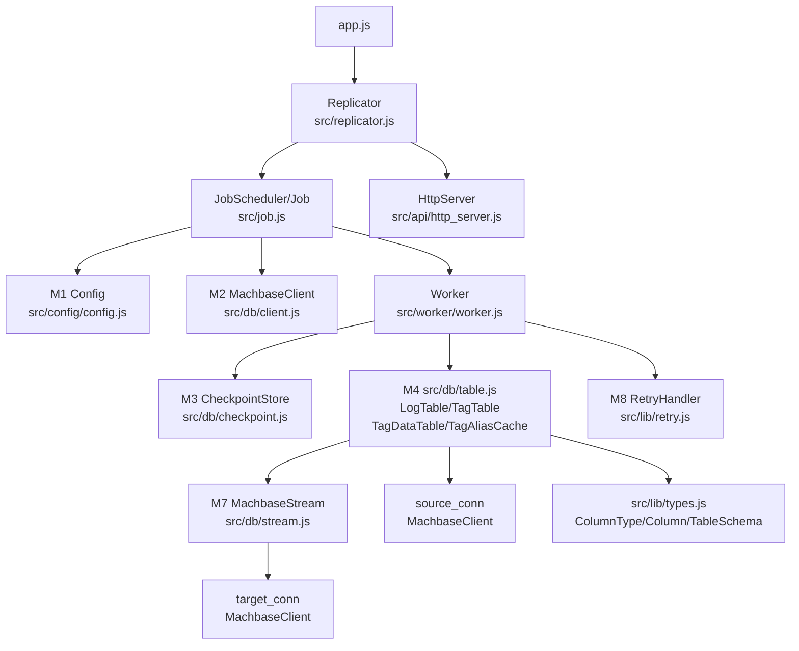
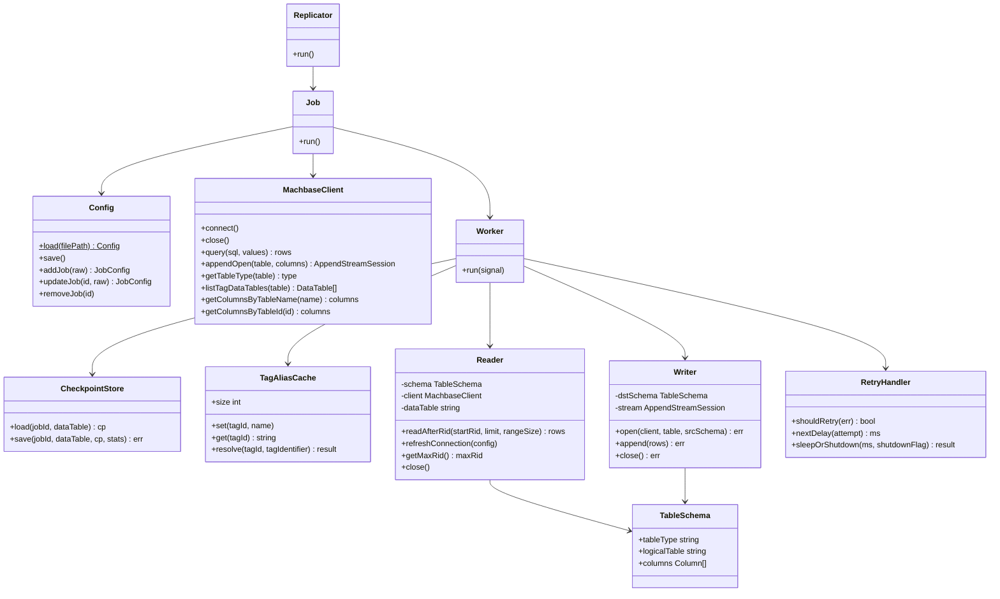
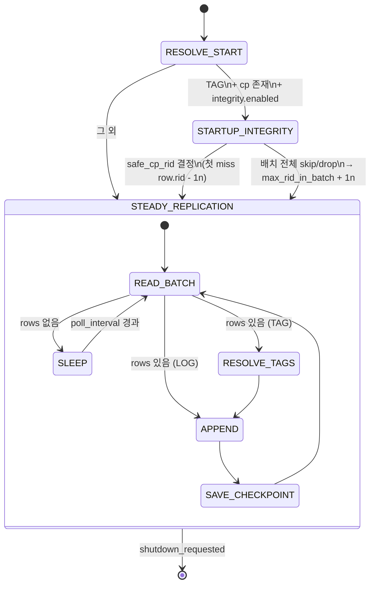
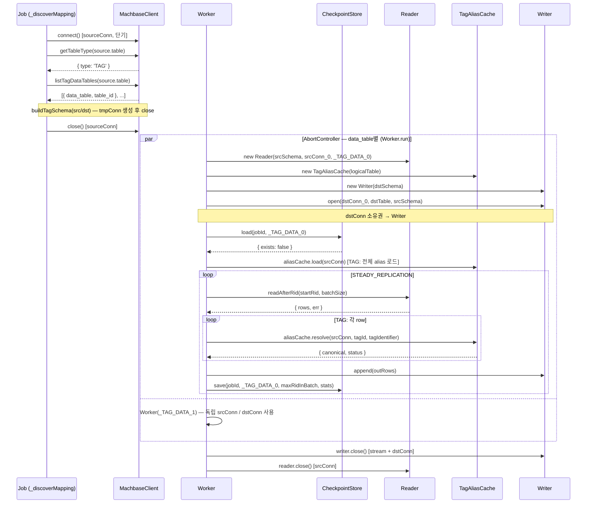

# repli-js 프로젝트 문서

**프로젝트**: Machbase TAG / Log 테이블 복제 도구
**런타임**: Node.js v22 (CommonJS)
**최종 수정**: 2026-03-17 (config 도메인 클래스 도입, execution flat화, servers array 전환)

---

## 목차

1. [프로젝트 개요](#1-프로젝트-개요)
2. [시스템 아키텍처](#2-시스템-아키텍처)
3. [설정 스키마](#3-설정-스키마)
4. [모듈 명세](#4-모듈-명세)
5. [핵심 동작 흐름](#5-핵심-동작-흐름)
6. [경계 조건 및 예외 시나리오](#6-경계-조건-및-예외-시나리오)
7. [에러 처리 정책](#7-에러-처리-정책)
8. [고정 정책 vs 설정 가능 항목](#8-고정-정책-vs-설정-가능-항목)
9. [테이블 타입별 동작 비교](#9-테이블-타입별-동작-비교)
10. [UML 다이어그램](#10-uml-다이어그램)
11. [확정 설계 결정 사항](#11-확정-설계-결정-사항)
12. [@machbase/ts-client 알려진 버그](#12-machbasets-client-알려진-버그)
13. [미결 사항 및 향후 과제](#13-미결-사항-및-향후-과제)

---

## 1. 프로젝트 개요

### 1.1 목적

원본 Database의 TAG / Log 테이블 데이터를 대상 Database 테이블로 지속 복제한다.
트랜잭션·PK가 없는 환경에서 `_rid` 기반 체크포인트를 활용하여 **at-least-once** 복제를 달성하고, 가능한 범위 내에서 정합성을 최대화한다.

### 1.2 목표 / 비목표

| 구분 | 항목 |
|------|------|
| **목표** | at-least-once 복제, 정합성 최대화 (Tag 테이블), Graceful Shutdown |
| **비목표** | Exactly-once 보장, Update/Delete 복제, 대상 테이블 생성/스키마 관리 |

### 1.3 핵심 제약

- DB 트랜잭션 없음, PK 없음 → 중복 발생 허용 (at-least-once)
- 복제 단위: `_rid` 기반 배치
- 설정 변경 시 프로세스 재시작 필요 (핫 리로드 미지원)

### 1.4 핵심 의존성

- `@machbase/ts-client@0.9.3` — CMI 프로토콜 기반 Machbase 네이티브 클라이언트

### 1.5 용어 정의

| 용어 | 정의 |
|------|------|
| 논리 테이블 | 원본 테이블. 실제 데이터를 저장하지 않고 메타 및 데이터 테이블 구성 정보만 보유 |
| 데이터 테이블 | 실제 데이터가 저장되는 테이블. Tag 테이블의 경우 `{logical}_DATA_{index}` 형태 |
| `_rid` | 데이터 테이블별 순차적이고 unique한 일련번호 (단조 증가) |
| 체크포인트 | 데이터 테이블별 마지막 성공 복제 `_rid` (파일로 저장) |
| canonical tag_name | tag_id → tag_name 변환 후 tag_identifier(prefix/suffix/none)를 적용한 최종 tag_name' |
| mapping | 하나의 소스 논리 테이블과 대상 테이블 간의 복제 단위 설정 |
| Worker | data_table 1개당 생성되는 독립 복제 실행 단위 |
| STARTUP_INTEGRITY | 재시작 직후 수행하는 중복 skip 및 시작 위치 보정 단계 (Tag 전용) |
| STEADY_REPLICATION | 정상 복제 루프 |
| max_rid_in_batch | STEADY에서 checkpoint advance 기준이 되는 `_rid` 값 — 배치 내 최대 RID (drop 여부 무관) |

---

## 2. 시스템 아키텍처

### 2.1 디렉토리 구조

```
repli-js/
├── app.js                      # 진입점 — Config.load() → Replicator.run()
├── config.json                 # 설정 파일 (v3 스키마)
├── src/
│   ├── replicator.js           # Replicator — SIGTERM/SIGINT, JobScheduler 관리
│   ├── job.js                  # JobScheduler, Job (재시작 루프 포함)
│   ├── api/
│   │   └── http_server.js      # HttpServer — REST API (JobScheduler에만 의존)
│   ├── config/
│   │   └── config.js           # Config + 도메인 클래스 전체 (ServerConfig, JobConfig 등)
│   ├── db/
│   │   ├── client.js           # MachbaseClient, fixDoubleEndian(), toInt64
│   │   ├── stream.js           # MachbaseStream, _toCell (append 스트림 래퍼)
│   │   ├── table.js            # TagAliasCache, LogTable, TagTable, TagDataTable
│   │   └── checkpoint.js       # CheckpointStore (atomic write, BigInt 지원 내장)
│   ├── worker/
│   │   └── worker.js           # Worker 상태 머신
│   └── lib/
│       ├── logger.js           # Logger 클래스 (날짜 로테이션, stdout/file)
│       ├── retry.js            # RetryHandler
│       └── types.js            # ColumnType, Column, TableSchema (순수 도메인 모델)
├── data/                       # 런타임 생성 — cp 파일 저장 디렉토리 (고정 경로)
├── tests/
│   ├── unit/
│   │   ├── checkpoint.test.js        # CheckpointStore 단위 테스트 (6개)
│   │   ├── client.test.js            # fixDoubleEndian 단위 테스트 (4개)
│   │   ├── config.test.js            # Config 단위 테스트 (30개)
│   │   ├── integrity_checker.test.js # TagTable.findFirstMissRow 단위 테스트 (7개)
│   │   ├── retry.test.js             # RetryHandler 단위 테스트 (19개)
│   │   └── worker.test.js            # Worker/Job/JobScheduler/Replicator + E2E mock (27개)
│   └── integration/
│       ├── tag_replication.test.js   # TAG 테이블 통합 테스트 (11개)
│       ├── log_replication.test.js   # LOG 테이블 통합 테스트 (8개)
│       └── table.test.js             # LogTable/TagTable/TagDataTable 통합 테스트 (17개)
├── docs/
│   ├── PROJECT.md               # 본 문서
│   └── ENDIAN_BUG.md            # @machbase/ts-client endian 버그 상세 분석
└── package.json
```

### 2.2 컴포넌트 구성

```
┌──────────────────────────────────────────────────────────────┐
│  Main Process                                                │
│                                                              │
│  app.js → Config.load() → new Replicator(config).run()       │
│                              │                               │
│           Replicator         │                               │
│           ├─ HttpServer  (REST API, JobScheduler에만 의존)    │
│           └─ JobScheduler                                    │
│               └─ Job (job당 1개, 독립 루프)                   │
│                   ├─ _discoverMapping() — MachbaseClient(단기)│
│                   ├─ AbortController                          │
│                   └─ Worker × N  (Promise.all, 병렬)         │
│                       ├─ TagDataTable/LogTable — 소스 DB 읽기 │
│                       ├─ TagTable/LogTable — 대상 DB 쓰기    │
│                       └─ Worker.run() — 상태 머신            │
└──────────────────────────────────────────────────────────────┘
```

### 2.3 Connection 관리 원칙 (설계 결정 B-01)

> **설계 번복 사유**: 통합 테스트 중 `@machbase/ts-client`가 단일 connection에서 동시 query 또는 append 호출 시 `"Unexpected protocol N, expected M"` 오류 발생 확인.

**확정 구조**: data_table(Worker)당 srcConn + dstConn 각 1개 생성

```
mapping (소스 table → 대상 table)
  [DISCOVER]  sourceConn: 1개  ── 타입/파티션 조회 후 close

  [Worker_0]  Reader(srcConn_0) + Writer(dstConn_0)  (appendOpen 포함)
  [Worker_1]  Reader(srcConn_1) + Writer(dstConn_1)  (appendOpen 포함)
  ...
  [Worker_N]  Reader(srcConn_N) + Writer(dstConn_N)  (appendOpen 포함)
```

- Reader가 srcConn을 소유, Writer가 dstConn을 소유 (close 책임도 각자)
- STARTUP_INTEGRITY에서 intConn(integrity 전용)은 배치마다 신규 생성 후 close
  - `@machbase/ts-client` 연결은 `end()` 후 재연결 불가 → 재사용 금지
  - statement ID 서버 한도(1024개/connection) 초과 방지

### 2.4 Machbase TAG 테이블 내부 구조

| 시스템 테이블 | 역할 |
|--------------|------|
| `_TAG_META` | 태그 메타 정보 (태그 이름 → `_ID` 매핑) |
| `_TAG_DATA_0` ~ `_TAG_DATA_N` | 실제 데이터 파티션 |
| `V$STORAGE_TAG_TABLES` | 파티션별 RID 범위 등 스토리지 정보 |
| `M$SYS_TABLES` / `M$SYS_COLUMNS` | 시스템 카탈로그 |

### 2.5 시스템 상태 머신

**Replicator 레벨**
```
start → [Job × N 병렬] → SIGTERM/SIGINT → graceful shutdown → exit
```

**Job 레벨 (job당 1개, 독립 루프)**
```
while(!shutdown):
  DISCOVER → Workers 병렬 실행 → (에러 → AbortController 전체 취소) → 재시작
```

**Worker 레벨 (data_table 1개당)**
```
RESOLVE_START → (STARTUP_INTEGRITY, TAG+체크포인트 존재 시) → STEADY_REPLICATION
```

---

## 3. 설정 스키마

### 3.1 최상위

| 필드 | 타입 | 필수 | 설명 |
|------|------|------|------|
| version | int | ✅ | 3 고정 |
| servers | ServerConfig[] | ✅ | 서버 접속 정보 배열 (name 필드로 참조) |
| replication.jobs | JobConfig[] | ✅ | 복제 작업 목록 |
| logging | LoggingConfig | — | 로깅 설정 |
| api | ApiConfig | — | REST API 설정 |

### 3.2 ServerConfig

```json
{ "name": "src", "host": "...", "port": 5656, "user": "SYS", "password": "MANAGER" }
```

### 3.3 JobConfig (flat 구조 — execution 블록 없음)

| 필드 | 타입 | 기본값 | 설명 |
|------|------|--------|------|
| id | string | — | 고유 식별자 |
| shutdown_timeout_ms | int | 30000 | Worker 종료 대기 타임아웃 (ms) |
| source | SourceConfig | ✅ | 소스 설정 |
| target | TargetConfig | ✅ | 대상 설정 |
| query_limit | int | 5000 | 배치당 최대 레코드 수 |
| rid_range_size | int | 50000 | RID 범위 힌트 크기 |
| poll_interval_ms | int | 1000 | 폴링 주기 (ms) |
| start_mode | "full"\|"now"\|"rid_after" | "full" | 최초 실행 시작 기준 |
| rid_after | string | — | start_mode=rid_after 시 기준 rid |
| on_save_failure | "continue"\|"abort" | "continue" | checkpoint 저장 실패 정책 |
| integrity | IntegrityConfig | — | 재시작 정합성 설정 |
| retry | RetryConfig | — | 재시도 설정 |

### 3.4 SourceConfig / TargetConfig

| 필드 | 타입 | 설명 |
|------|------|------|
| source.server | string | servers[].name 참조 |
| source.table | string | 원본 논리 테이블명 |
| source.columns | string[]\|null | SELECT 허용 컬럼 목록. null이면 전체 컬럼. UPPERCASE 정규화. |
| source.tag_identifier | TagIdentifierConfig | tag name 식별자 방식 (mode: prefix/suffix/none) |
| target.server | string | servers[].name 참조 |
| target.table | string | 대상 테이블명 (사전 생성 필요) |

### 3.5 체크포인트 파일 포맷

**저장 경로**: `data/{job_id}_{data_table}.json` (고정, 설정 불필요)

```json
{
  "version": 1,
  "job_id": "<string>",
  "source": {
    "server": "<server_alias>",
    "table": "<logical_table>",
    "data_table": "<data_table_name>"
  },
  "checkpoint": {
    "last_success_rid": "<BigInt as string>",
    "updated_at": "<RFC3339>"
  }
}
```

---

## 4. 모듈 명세

### M1. Config (`src/config/config.js`)

```js
// 로드
const config = await Config.load(filePath?)   // 기본: ./config.json

// 저장 (atomic write)
await config.save()

// Job CRUD
config.addJob(rawJob)           → JobConfig
config.updateJob(id, rawJob)    → JobConfig
config.removeJob(id)
```

**도메인 클래스 및 valid() 패턴**
- `new XxxConfig(raw)` → `instance.valid()` 순서로 생성·검증
- `Config._buildJob(job, servers)` 내부에서 모든 하위 클래스 생성
- 각 클래스의 검증 책임:
  - `ServerConfig.valid()`: name/host/port/user/password 필수
  - `SourceConfig.valid(jobId, servers)`: table 필수, server 참조 유효성, columns/tag_identifier 검증
  - `TargetConfig.valid(jobId, servers)`: table 필수, server 참조 유효성
  - `TagIdentifierConfig.valid(jobId)`: mode 값 범위, value 타입
  - `IntegrityConfig.valid(jobId)`: enabled boolean
  - `RetryConfig.valid(jobId)`: strategy/max_attempts/delay 값 범위
  - `LoggingConfig.valid()` + `LoggingFileConfig.valid()`: level/stdout/file 검증
  - `JobConfig.valid(servers)`: 모든 execution 필드 + source/target 위임 검증

**JobConfig 기본값** (constructor에서 `??` 연산자로 적용)
- `query_limit=5000`, `rid_range_size=50000`, `poll_interval_ms=1000`, `start_mode='full'`, `on_save_failure='continue'`

**source.columns 정규화**
- `null`/`undefined` → `columns: null` (전체 컬럼)
- 비어있지 않은 문자열 배열 → UPPERCASE 정규화
- 빈 배열 또는 비문자열 항목 → throw

---

### M2. MachbaseClient 카탈로그 메서드 (`src/db/client.js`)

```js
conn.getTableType(table) → { type: "TAG"|"LOG"|"UNSUPPORTED" }
conn.listTagDataTables(logicalTable) → [{ data_table, table_id }]
conn.getColumnsByTableName(tableName) → [{ NAME, TYPE, ID }]
conn.getColumnsByTableId(tableId) → [{ NAME, TYPE, ID }]
```

**구현 항목**
- `getTableType`: `M$SYS_TABLES.TYPE` — 6=TAG, 0=LOG, 그 외=UNSUPPORTED. 조회 실패 시 throw.
- `listTagDataTables`: `V$STORAGE_TAG_TABLES + M$SYS_TABLES` 조인으로 파티션 목록 조회.
  - `table_id`는 `@machbase/ts-client`가 반환하는 ulong(BigInt) 그대로 유지.
- `getColumnsByTableName`: META·LOG 컬럼 조회 (`M$SYS_COLUMNS + M$SYS_TABLES` JOIN)
- `getColumnsByTableId`: DATA 파티션 컬럼 조회 (`M$SYS_COLUMNS`, table_id 기준, BigInt 파라미터 허용)
- JobRunner의 DISCOVER 단계에서 호출, 결과를 기반으로 Worker 생성

---

### M3. CheckpointStore (`src/db/checkpoint.js`)

```js
CheckpointStore.load(jobId, dataTable) → { cp, exists, err }
CheckpointStore.save(jobId, dataTable, cp, stats) → err
```

**구현 항목**
- atomic write 내장 (tmp 파일 → rename). `file.js` 별도 모듈 없이 헬퍼 함수(`_stringify`, `_parse`, `_writeFile`)로 내장.
- 파일 없음 → `{ exists: false, err: null }`
- JSON 파싱 실패 → `{ exists: false, err: ... }` + stage="checkpoint_io" 로그
- `source.data_table` ≠ 파일명 내 data_table → 손상 처리, 무효화
- `on_save_failure="continue"`: 오류 로그 + Worker 메모리 기준 rid로 계속
- `on_save_failure="abort"`: TODO (현재 continue와 동일하게 동작)
- 저장 성공 시 `checkpoint_saved` 구조화 로그 출력 (stats 4개 필드 포함)

---

### M4. TagAliasCache / LogTable / TagTable / TagDataTable (`src/db/table.js`)

```js
// ── TagAliasCache ──
cache = new TagAliasCache()
cache.set(tagId, name)
cache.get(tagId) → string|undefined
cache.resolve(tagId, tagIdentifier) → { canonical, status: 'ok'|'drop_not_found' }
cache.size

// ── LogTable ──
logTable = new LogTable(logicalTable, config)
await logTable.open(useStream?)   // DB 연결 + 선택적 append 스트림 열기
await logTable.close()
await logTable.getSchema() → TableSchema
await logTable.read(startRid, limit?, rangeSize?) → { rows, err }
await logTable.append(rows) → Error|null
await logTable.getMaxRid() → BigInt

// ── TagTable ──
tagTable = new TagTable(logicalTable, config)
await tagTable.open(useStream?)
await tagTable.close()
await tagTable.getSchema(dataTableId) → TableSchema   // META + DATA 파티션 조합
await tagTable.getDataTables() → [{ data_table, table_id }]
await tagTable.append(rows) → Error|null

// ── TagDataTable ──
dataTable = new TagDataTable(dataTable, config)
await dataTable.open()
await dataTable.close()
await dataTable.loadTagAliasCache() → null   // 내부 aliasCache 구성
await dataTable.read(startRid, limit?, rangeSize?, tagIdentifier?, sourceColumns?) → { rows, err }
await dataTable.getMaxRid() → BigInt
```

**구현 항목**
- `TagAliasCache.set`: name에 `\x00` 포함 시 throw — existSet key 충돌 방지 (캐시 입력 시점에서 차단)
- `TagAliasCache.resolve`: 캐시에서만 조회. miss → `drop_not_found` (단건 DB 조회는 Worker가 담당)
- `TagAliasCache._applyIdentifier(tagName, tagIdentifier)`: prefix/suffix/none 변환
- `LogTable`/`TagTable`: `MachbaseClient` 내부 생성, `open(useStream=false)` 시 연결 (스트림 선택적)
- `TagTable.getSchema(dataTableId)`: META 컬럼 + DATA 파티션 컬럼 조합
- `TagDataTable.read`: aliasCache 설정 시 tagId → canonical name resolve, drop_not_found 행 제외
- 행 구조: `{ rid: BigInt, data: { NAME, TIME, VALUE, ... } }` (UPPERCASE key)

**SQL (TAG 읽기)**
```sql
SELECT /*+ RID_RANGE(data_table, startRid, endRid) */
       _RID, name, time, value
FROM   data_table
WHERE  _RID >= startRid
LIMIT  limit
```

---

### M5. ColumnType / Column / TableSchema (`src/lib/types.js`)

```js
// ColumnType 정적 상수: SHORT, INTEGER, LONG, ULONG, DATETIME, FLOAT, DOUBLE, VARCHAR, ...
// ddlType: CREATE TABLE DDL 타입 문자열 (고정 길이) 또는 null (VARCHAR 등 가변)
ColumnType.fromCode(typeCode) → ColumnType   // M$SYS_COLUMNS.TYPE 코드 → 인스턴스

// Column
new Column(name, columnType, id, category, length = 0)
// category: 'key'(TAG NAME), 'data', 'metadata'
// length: M$SYS_COLUMNS.LENGTH (VARCHAR 가변 길이용)
col.dataType()   // appendOpen 프로토콜 타입 문자열 (col.columnType.type과 동일)
col.safeNull()   // append 패딩용 null 대체값 (col.columnType.safeNull과 동일)
col.sqlType()    // CREATE TABLE DDL 타입 (예: 'VARCHAR(80)', 'DOUBLE')

// TableSchema
new TableSchema(tableType, logicalTable, columns)
schema.columns          // Column[] 전체 배열 (dataColumns + metadataColumns)
```

---

### M6. TagTable / LogTable — findFirstMissRow() (`src/db/table.js`)

```js
await tagTable.findFirstMissRow(rows, client) → { firstMissIdx: number|null, err }
await logTable.findFirstMissRow(rows, client) → { firstMissIdx: number|null, err }
```

**구현 항목**
- VOLATILE TABLE + JOIN 방식으로 배치 내 첫 번째 miss row의 0-based 인덱스를 반환
- STARTUP_INTEGRITY에서만 사용 (STEADY 중 미사용)
- `rows`: `[{ canonical: string, time: bigint }]` — read() 후 resolved된 배열
- `client`: 배치마다 신규 생성되는 독립 연결 (`intConn`)
- 내부 동작:
  1. `CREATE VOLATILE TABLE _repli_chk (IDX INT, NAME {nameDdlType}, TIME DATETIME)`
  2. `CREATE VOLATILE TABLE _repli_lkp (NAME {nameDdlType}, TIME DATETIME)`
  3. append 스트림으로 `_repli_chk`에 `[idx, canonical, time]` INSERT
  4. `INSERT INTO _repli_lkp SELECT t.NAME, t.TIME FROM {logicalTable} t, _repli_chk c WHERE t.NAME=c.NAME AND t.TIME=c.TIME`
  5. `SELECT IDX FROM (SELECT c.IDX, t.NAME AS T_NAME FROM _repli_chk c LEFT OUTER JOIN _repli_lkp t ON ...) WHERE T_NAME IS NULL ORDER BY IDX ASC LIMIT 1`
  6. finally: `DROP TABLE _repli_chk`, `DROP TABLE _repli_lkp`
- `nameDdlType`: `nameCol.sqlType()` — schema의 NAME 컬럼에서 추출 (예: `'VARCHAR(80)'`)
- Machbase 제약: TAG 테이블은 JOIN 드라이빙 불가 → VOLATILE TABLE 경유 필수; `WHERE joined_col IS NULL`은 서브쿼리 바깥에 위치 필수

---

### M7. MachbaseStream / _toCell (`src/db/stream.js`)

```js
// ── MachbaseStream ──
stream = new MachbaseStream()
await stream.open(client, table, columns) → Error|null
await stream.append(matrix) → Error|null
await stream.close() → Error|null

// ── _toCell ──
_toCell(col, val) → appendable value
```

**구현 항목**
- `MachbaseStream`: appendOpen 스트림 생명주기 래퍼. client 생명주기는 호출자(LogTable/TagTable)가 관리
- `_toCell(col, val)`: 순수 변환 함수 (로그 없음)
  - null/undefined → `col.safeNull()`
  - int64 컬럼 (`col.dataType() === 'int64'`) → `toInt64(val)` (BigInt 변환)
  - non-finite float → `col.safeNull()`

---

### M8. RetryHandler (`src/lib/retry.js`)

```js
RetryHandler.shouldRetry(err) → bool
RetryHandler.nextDelay(attempt) → ms
RetryHandler.sleepOrShutdown(ms, shutdownFlag) → Promise<"timeout"|"shutdown">
```

**구현 항목**
- strategy: "exponential" → `initial_delay_ms * multiplier^attempt`
- strategy: "linear" → `initial_delay_ms * (attempt + 1)`
- 계산값이 max_delay_ms 초과 시 max_delay_ms 적용
- jitter=true → `delay * Math.random()`
- max_attempts: null=무한, 초과 시 mapping 스킵
- 재시도 불가 오류(설정 오류, TAG 컬럼 규칙 위반, TYPE 불일치) → 즉시 스킵
- `sleepOrShutdown`: `Promise.race([setTimeout(ms), shutdownSignal])` 구현

---

### M9. Worker (`src/worker/worker.js`)

```js
runDataTableWorker({
  jobId, mapping, tableType, dataTable,
  srcSchema, dstSchema, srcConfig, dstConfig,
  reader, aliasCache, writer, shutdownFlag
}) → Promise<void>
```

**상태 전이**
```
RESOLVE_START → (STARTUP_INTEGRITY, TAG+cp존재+integrity.enabled) → STEADY_REPLICATION
```

**RESOLVE_START**
- `checkpointStore.load(jobId, dataTable)`
- cp 존재 → `startRid = cp.last_success_rid + 1n` (start_mode 무시)
- cp 없음/손상 → start_mode 기준: `full`=0n, `now`=`reader.getMaxRid() + 1n`, `rid_after`=설정값
- TAG 테이블: `reader.aliasMap.size === 0`이면 `reader.loadAliases()` 호출

**STARTUP_INTEGRITY_PHASE**
- 진입 조건: `tableType === 'TAG'` && `cpExists` && `exec.integrity?.enabled !== false`
- 배치마다 신규 `intConn = new MachbaseClient(dstConfig)` 생성 후 finally에서 close
- `dstTable.findFirstMissRow(resolved, intConn)` — VOLATILE TABLE + JOIN으로 첫 번째 miss idx 반환
- 첫 번째 miss row 발견 → `safeCpRid = firstMissRid - 1n`, cp 저장, `startRid = firstMissRid`, STEADY 진입
- 배치 전체 skip/drop → `cp.last_success_rid = maxRidInBatch`, `integrityRid = maxRidInBatch + 1n`, 다음 배치
- 소스가 빈 배열 → `startRid = integrityRid`로 유지하고 STEADY 진입

**STEADY_REPLICATION_LOOP**
```
stmtCount = 0  (배치당 2 statement 소비 — MAX + SELECT)

while NOT shutdown_requested:
  if stmtCount >= 900: reader.refreshConnection(srcConfig); stmtCount = 0

  rows = _readBatch(reader, startRid, batchSize, ...)  [retry 포함]
  stmtCount += 2
  if rows.empty: sleepOrShutdown(poll_interval_ms); continue

  maxRidInBatch = MAX(rows.rid)

  [TAG] 각 row: aliasCache.resolve() → drop 시 skip
        outRows.push({ NAME: canonical, TIME: ..., VALUE: ..., ... })
  [LOG] outRows.push({ TIME: ..., VALUE: ..., ... })

  if outRows not empty:
    _appendRows(writer, outRows, ...)  [retry 포함]

  // checkpoint는 항상 maxRidInBatch 기준 (drop된 row는 의도적 skip, 안전하게 전진)
  checkpointStore.save(..., { last_success_rid: maxRidInBatch }, stats)
  startRid = maxRidInBatch + 1n
```

---

### Replicator / JobScheduler / Job / Worker

- **`src/replicator.js`**: `Replicator` — SIGTERM/SIGINT 처리, `JobScheduler.stopAll()`, `HttpServer` 시작/종료
- **`src/job.js`**: `JobScheduler` (job 생명주기), `Job` (복제 루프)

클래스 구조: `Replicator.run()` → `JobScheduler.start(id)` → `Job.run()` → `Worker.run(signal)`

**`Job.run()` 구현 항목**
1. `while (!shutdown)` 루프:
   - `_discoverMapping()` — 각 mapping에 대해 sourceConn(단기) 생성 후 close:
     - `getTableType()` → TAG / LOG / UNSUPPORTED
     - TAG: `listTagDataTables()` → 파티션 목록, `buildTagSchema()` (src/dst)
     - LOG: `dataTables = [source.table]`, `buildLogSchema()` (src/dst)
     - src-only 컬럼 검출: 대상에 없는 소스 컬럼 → 해당 mapping 스킵
   - discover 성공한 mapping 당 `Worker` 인스턴스 생성
   - `AbortController`로 전체 Worker 묶어 `Promise.all` 병렬 실행
   - 에러 발생 시 `ac.abort()` → 전체 취소 → 루프 재시작

**`Worker.run(signal)` 구현 항목**
- signal.aborted 또는 shutdownFlag.value를 proxy `effectiveShutdown`으로 결합
- Reader(srcConn), TagAliasCache, Writer(dstConn) 생성 후 `runDataTableWorker()` 호출

**Graceful Shutdown**
- SIGTERM / SIGINT → `shutdownFlag.value = true` + 타이머 시작
- `shutdown_timeout_ms` 초과 → `level="warn"` 로그 + `process.exit(1)`
- 정상 종료 시 `clearTimeout(timeoutHandle)` 호출 (Node.js 이벤트 루프 블록 방지)

---

### @machbase/ts-client API 참조

`createConnection(config)` → `Connection` 객체 반환.

| 메서드 | 시그니처 | 설명 |
|--------|----------|------|
| `connect()` | `() → Promise<void>` | DB 연결 |
| `end()` | `() → Promise<void>` | 연결 종료 |
| `query()` | `(sql, values?) → Promise<[rows, fields]>` | SQL 쿼리 실행 |
| `execute()` | `(sql, values?) → Promise<[result, fields]>` | SQL 실행 |
| `appendOpen()` | `(table, columns, options?) → Promise<AppendStreamSession>` | Append 스트림 오픈 |

**컬럼 타입 매핑**

| Machbase 내부 타입 코드 | 이름 |
|------------------------|------|
| 4 / 104 | short / ushort |
| 8 / 108 | integer / uinteger |
| 12 / 112 | long / ulong |
| 16 | float |
| 20 | double |
| 5 | varchar |
| 49 | text |
| 6 | datetime |
| 61 | json |

---

## 5. 핵심 동작 흐름

### 5.1 초기화 흐름

```
1. Config.load()
2. Replicator.run() → JobScheduler 초기화 (job 자동 시작 없음, API로 개별 시작)
3. HttpServer 시작 (api.enabled=true 시)
4. 각 Job.run() 루프:
   a. _discoverMapping() — MachbaseClient(단기) 생성 후 close
      - 테이블 TYPE 조회
      - TAG이면 데이터 테이블 목록 조회 + src-only 컬럼 검증
      - 오류 시 해당 mapping 스킵 (job은 계속)
   b. data_table마다 Worker 인스턴스 생성
   c. AbortController로 Worker × N 병렬 실행
5. SIGTERM / SIGINT → shutdownFlag.value = true → graceful shutdown
```

### 5.2 Worker 시작점 결정 (RESOLVE_START)

```
1. CheckpointStore.load()
2. 체크포인트 존재 & 파싱 성공:
   start_rid = cp.last_success_rid  (start_mode 무시, 고정 정책)
3. 체크포인트 없음/손상:
   - full     → start_rid = 0n
   - now      → start_rid = SourceReader.getMaxRid()
   - rid_after → start_rid = config.rid_after
4. (TAG + 체크포인트 존재 + integrity.enabled) 이면:
   start_rid = STARTUP_INTEGRITY_PHASE(start_rid)
5. STEADY_REPLICATION_LOOP(start_rid)
```

### 5.3 STARTUP_INTEGRITY_PHASE (Tag 전용)

```
while NOT shutdown_requested:
  intConn = new MachbaseClient(dstConfig)  // 배치마다 신규 생성

  rows = srcTable.read(integrityRid, batch_size)
  if empty: SAVE_CHECKPOINT(integrityRid); enter STEADY
  max_rid_in_batch = MAX(rows.rid)

  resolved = rows.map(r => { rid, canonical: r.data.NAME, time: r.data.TIME })

  { firstMissIdx, err } = dstTable.findFirstMissRow(resolved, intConn)
  //  VOLATILE TABLE + JOIN — DB가 miss row의 0-based 인덱스를 직접 반환

  if firstMissIdx !== null:
    firstMissRid = resolved[firstMissIdx].rid
    safe_cp_rid = firstMissRid - 1n
    SAVE_CHECKPOINT(safe_cp_rid)
    return firstMissRid  // STEADY는 이 rid부터 시작

  // 배치 전체 존재 → 다음 배치
  SAVE_CHECKPOINT(max_rid_in_batch)
  integrityRid = max_rid_in_batch + 1n
  intConn.close()
```

### 5.4 STEADY_REPLICATION_LOOP

```
while NOT shutdown_requested:
  rows = readAfterRid(start_rid, batch_size)
  if empty: SLEEP_OR_SHUTDOWN(poll_interval_ms); continue

  max_rid_in_batch = MAX(rows.rid)

  [TAG] rows → aliasCache.resolve → canonical tag_name' 치환 → out_rows
  [LOG] out_rows = rows 그대로

  if out_rows is not empty:
    write(out_rows)
    if error: retry → continue

  // checkpoint는 항상 max_rid_in_batch 기준
  // drop된 row는 소스 META 부재로 인한 의도적 skip → 안전하게 전진
  SAVE_CHECKPOINT(max_rid_in_batch)
  start_rid = max_rid_in_batch + 1n
```

> **핵심**: checkpoint의 `last_success_rid`는 항상 `max_rid_in_batch`로 저장한다.
> drop된 row(TAG META 없음)도 의도적 skip이므로, 배치 최대 RID 기준으로 전진하는 것이 안전하다.

### 5.5 Graceful Shutdown

```
[메인 프로세스]
SIGTERM 수신
  → shutdownFlag.value = true
  → 모든 Worker 종료 대기 (최대 shutdown_timeout_ms ms)
  → 타임아웃 초과 시 강제 종료 + level="warn" 경고 로그

[Worker]
  → 배치 루프 시작 시 shutdownFlag 확인
  → true이면 루프 탈출 (진행 중 배치는 완료 후 종료)
  → SLEEP 중에도 즉시 깨어남
```

---

## 6. 경계 조건 및 예외 시나리오

### 6.1 체크포인트 파일 상태별 처리

| 상태 | 처리 동작 |
|------|-----------|
| 파일 없음 | `exists=false`, `err=null` → start_mode 기준으로 시작점 결정 |
| 파일 있음, 파싱 성공, data_table 일치 | `exists=true`, cp 반환 → `cp.last_success_rid` 기준으로 시작 |
| 파일 있음, JSON 파싱 실패 | `exists=false`, `err=parseError` + stage="checkpoint_io" 오류 로그 → "없음"으로 취급 |
| 파일 있음, `source.data_table` 불일치 | `exists=false`, `err=corruptionError` + "data_table mismatch" 오류 로그 → "없음"으로 취급 |
| `.tmp` 파일만 남아 있음 | `.tmp` 파일 무시, `.json` 파일 기준으로 처리 |

### 6.2 start_mode별 시작점 결정 (체크포인트 없음 시)

| start_mode | 시작점 결정 로직 | 엣지 케이스 |
|------------|-----------------|-------------|
| full | `start_rid = 0n` | 데이터 없어도 0n으로 시작, 즉시 빈 배열 반환 후 폴링 |
| now | `start_rid = SourceReader.getMaxRid()` | 빈 테이블이면 0n 반환, 이후 새 데이터부터 복제 |
| rid_after | `start_rid = mapping.source.rid_after` (BigInt) | rid_after가 실제 max_rid보다 크면 빈 배열 반환 후 폴링 |

**공통 규칙**: 체크포인트가 존재하면 start_mode는 무조건 무시된다 (고정 정책).

### 6.3 STARTUP_INTEGRITY 배치 전체 skip/drop 발생 시

- 배치 내 모든 row가 `skipped_exists` 또는 `dropped_no_meta`인 경우
- `SAVE_CHECKPOINT(max_rid_in_batch + 1n)` → `start_rid = max_rid_in_batch + 1n`
- 다음 배치 읽기 계속 (STARTUP_INTEGRITY 루프 유지)

### 6.4 STEADY_REPLICATION all-drop 발생 시

- TAG 테이블에서 배치 내 모든 row가 `drop_not_found`로 처리된 경우 (`out_rows` 비어있음)
- write는 수행하지 않지만 `SAVE_CHECKPOINT(max_rid_in_batch)`로 체크포인트를 전진시킨다.
- drop_not_found는 소스 META 부재로 인한 의도적 skip이므로, 배치를 "처리 완료"로 간주하는 것이 올바르다.

### 6.5 Graceful Shutdown 처리

| 시나리오 | 처리 동작 |
|----------|-----------|
| SIGTERM 수신, Worker들이 SLEEP 중 | 각 Worker가 SLEEP에서 즉시 깨어나 루프 탈출 → 체크포인트 저장 후 종료 |
| SIGTERM 수신, Worker가 배치 처리 중 | 현재 배치 완료 + 체크포인트 저장 후 루프 탈출 |
| `shutdown_timeout_ms` 이내 전체 종료 | 정상 종료 로그 출력 |
| `shutdown_timeout_ms` 초과, 일부 Worker 미종료 | `level="warn"` 경고 로그 + 강제 종료 (중복 허용 범위) |

### 6.6 체크포인트 저장 실패 처리

| `on_save_failure` | 처리 동작 |
|-------------------|-----------|
| `"continue"` (기본값) | `level="error"` 로그 출력. Worker는 메모리 기준 rid로 계속 처리. 다음 재시작 시 중복 증가 가능 |
| `"abort"` | TODO — 현재 `"continue"`와 동일하게 동작 + TODO 경고 로그 출력 |

### 6.7 스키마 불일치 처리 정책

| 불일치 유형 | 처리 |
|------------|------|
| 원본에 있고 대상에 없는 컬럼 | 해당 컬럼 값을 write에서 제외 (무시) |
| 대상에 있고 원본에 없는 컬럼 | Null로 채움 |

---

## 7. 에러 처리 정책

| 오류 유형 | 발생 단계 | 처리 |
|-----------|-----------|------|
| 설정 오류 (잘못된 값, 참조 오류) | INIT | mapping 스킵 |
| TAG 컬럼 규칙 위반 | DISCOVER | mapping 스킵 |
| TYPE 불일치 / 미지원 | DISCOVER | mapping 스킵 |
| 카탈로그 조회 실패 | DISCOVER | mapping 스킵 |
| 체크포인트 파싱 실패 | RESOLVE_START | "없음" 취급 + 로그 |
| 체크포인트 저장 실패 | SAVE_CHECKPOINT | on_save_failure 정책 적용 |
| 소스 읽기 오류 (네트워크) | READ | retry |
| tag_id 메타 조회 오류 (not found) | META_LOOKUP | row drop |
| tag_id 메타 조회 오류 (일시) | META_LOOKUP | retry |
| 존재 여부 검색 오류 | INTEGRITY_CHECK | retry |
| 대상 쓰기 오류 (네트워크) | WRITE | retry |
| 재시도 횟수 초과 (max_attempts 도달) | 각 단계 | mapping 스킵 |

**재시도 불가 오류 (즉시 mapping 스킵)**
- 설정 오류, TAG 컬럼 규칙 위반, 테이블 TYPE 불일치, 대상 테이블 미존재

**구조화 로그 필수 포함 정보**
```json
{
  "stage": "catalog | checkpoint_io | read | meta_lookup | integrity_check | write",
  "job_id": "<string>",
  "mapping_id": "<string>",
  "data_table": "<string>",
  "raw": "<원본 에러 메시지>"
}
```

**체크포인트 저장 성공 시 로그 (`checkpoint_saved`)**
```json
{
  "level": "info",
  "stage": "checkpoint_saved",
  "job_id": "<string>",
  "data_table": "<string>",
  "last_success_rid": "<BigInt as string>",
  "rows_read": 0,
  "rows_written": 0,
  "dropped_no_meta": 0,
  "skipped_exists": 0
}
```

---

## 8. 고정 정책 vs 설정 가능 항목

### 8.1 고정 정책 (설정 파일에 노출되지 않음)

| 항목 | 고정값 | 설명 |
|------|--------|------|
| `max_inflight_batches` | 1 | 1 Worker당 동시 처리 배치 1개 |
| `single_instance_per_data_table` | true | 1 data_table = 1 Worker, 중복 실행 없음 |
| `atomic_write` | true | 체크포인트 파일은 항상 tmp → rename |
| `skip_when_table_type_unsupported` | true | 미지원 TYPE은 mapping 단위로 스킵 |
| `config_hot_reload` | false | 설정 변경 시 프로세스 재시작 필요 |
| `integrity.mode` | `"existence_only"` | tag_name+time 존재 여부만 확인 |
| `tag_column_position` | 1번째=tag, 2번째=time | Tag 테이블 컬럼 규칙, 설정으로 변경 불가 |
| `startup_integrity_scope` | 재시작 직후 보정 구간만 | STEADY 중 존재 여부 검색 수행 안 함 |

---

## 9. 테이블 타입별 동작 비교

| 항목 | Tag 테이블 (TYPE=6) | Log 테이블 (TYPE=0) |
|------|--------------------|--------------------|
| 논리/데이터 구조 | 논리 테이블 ≠ 데이터 테이블 (1:N) | 논리 테이블 = 데이터 테이블 (1:1) |
| data_table 목록 조회 | `V$STORAGE_TAG_TABLES`에서 조회 | `[source.table]` 1개 고정 |
| 컬럼 규칙 검증 | 1번째=tag id(integer), 2번째=time(int64) 검증 | 검증 없음 |
| 매핑 제한 | 1:1, 1:n, n:m 모두 허용 | 1:1만 허용 (n:1 금지) |
| tag_id → canonical 변환 | 수행 (resolveTagCanonical) | 수행하지 않음 |
| tag_identifier 적용 | 적용 (prefix/suffix/none) | 적용하지 않음 |
| STARTUP_INTEGRITY 수행 | 체크포인트 있고 integrity.enabled=true 시 수행 | 수행하지 않음 |
| 재시작 중복 방지 | 가능 (tag_name + time 존재 여부 확인) | 불가능 (의도적 허용) |
| drop_not_found 처리 | tag_id 메타 없으면 row drop, cp 전진 | 해당 없음 |
| stats.skipped_exists 발생 | STARTUP_INTEGRITY에서만 발생 | 발생하지 않음 |
| checkpoint advance (all-drop) | `max_rid_in_batch + 1n` (fallback) | 해당 없음 |

---

## 10. UML 다이어그램

### 10.1 컴포넌트 다이어그램 — 모듈 의존 관계



### 10.2 클래스 다이어그램



### 10.3 Worker 상태 머신



### 10.4 시퀀스 다이어그램 — 메인 복제 흐름



---

## 11. 확정 설계 결정 사항

| ID | 항목 | 결정 |
|----|------|------|
| B-01 | target connection / stream 공유 방식 | **Worker(data_table)당 독립** srcConn(Reader 소유) + dstConn(Writer 소유) 생성 |
| B-02 | `on_save_failure="abort"` 동작 | 코드 상 TODO 주석으로 남김. 현재는 "continue"와 동일하게 동작 |
| B-03 | 설정 파일 형식 | JSON 채택 |
| D-01 | SourceReader SQL 방식 | RID_RANGE 힌트 + `_RID >= startRid` 조건 병용. endRid는 `MAX(_RID)` 실제 조회값 |
| D-02 | TagMetaProvider 메타 로드 방식 | Read-through cache. Worker 시작 시 전체 로드, miss 시 단건 DB 조회 |
| D-03 | `getMaxRid()` 실패 시 처리 | SKIP_MAPPING (worker 즉시 return) |
| D-04 | Reader/Writer conn 소유 방식 | Reader가 srcConn 소유·close, Writer가 dstConn 소유·close. setup 실패 시 JobRunner가 해당 경로에서 직접 close |
| B-04 | Job 재시작 전략 | Worker 하나라도 에러 시 AbortController로 전체 취소 → while(!shutdown) 루프로 Job 전체 재시작. job 독립(다른 job에 영향 없음) |
| B-05 | AbortSignal → shutdownFlag 연동 | Worker.run()은 `signal.aborted || shutdownFlag.value` proxy 객체를 runDataTableWorker에 전달하여 abort 시 STEADY 루프 즉시 탈출 |
| — | STARTUP_INTEGRITY retry 시 배치 재처리 범위 | 배치 내 이미 처리한 row는 건너뜀, 실패 row부터 재처리 |
| — | Statement ID 고갈 대응 (STEADY) | stmtCount 추적, 900 도달 시 `reader.refreshConnection(srcConfig)` 호출 |

---

## 12. @machbase/ts-client 알려진 버그

#### 버그: FLOAT/DOUBLE 쿼리 결과 endian 오류

- **버전**: `@machbase/ts-client@0.9.3`
- **위치**: `node_modules/@machbase/ts-client/dist/connection.js`, `decodeFixedField()` 함수 (1164~1167줄)

**원인**

`decodeFixedField()`는 쿼리 결과 행의 고정 길이 필드를 디코딩하는 standalone 함수다. 정수 계열(`INT16`~`INT64`, `UINT16`~`UINT64`, `DATETIME`)은 Big-Endian(`readInt16BE` 등)으로 읽고, 부동소수점 계열(`FLT32`, `FLT64`)은 **Little-Endian**(`readFloatLE`, `readDoubleLE`)으로 읽도록 하드코딩되어 있다.

```js
// connection.js:1164-1167 (버그 있는 원본 코드)
case CMD_FLT32_TYPE:
    return field.readFloatLE(0);   // ← 항상 LE
case CMD_FLT64_TYPE:
    return field.readDoubleLE(0);  // ← 항상 LE
```

그러나 Machbase 서버의 TAG 데이터 파티션은 **파티션 인덱스(DATA_0, DATA_1, …)에 따라 DOUBLE 값을 BE 또는 LE로 저장**한다. 서버가 BE로 저장한 값을 클라이언트가 LE로 읽으면, IEEE 754 상 지수부가 0에 가까운 극소값(denormal)으로 해석된다.

**예시**

| 실제 값 | BE 저장 바이트 | LE로 잘못 읽은 결과 |
|---------|---------------|-------------------|
| `3200.0` | `40 A9 00 00 00 00 00 00` | `2.1407e-319` |
| `85.0`   | `40 55 40 00 00 00 00 00` | `2.083044e-317` |
| `1.1`    | `3F F1 99 99 99 99 99 9A` | `1.1` (DATA_1: LE 저장이므로 정상) |

연결 핸드셰이크에서 `serverEndian = 0`(LE)으로 기록하지만(`429~438줄`), `decodeFixedField()`는 `serverEndian`을 받는 파라미터가 없어 이 정보를 사용할 수 없다.

**우회 구현**

BE로 저장된 값을 LE로 잘못 읽으면 반드시 **denormal**(비정규 부동소수점, `0 < |v| < 2.2250738585072014e-308`)이 된다. 반대로 실측 센서값이 우연히 denormal 범위에 들어오는 경우는 실무상 없으므로, `machbase/machbase.js`의 `fixDoubleEndian()` 함수에서 다음과 같이 사후 보정한다. 상세 분석은 [ENDIAN_BUG.md](./ENDIAN_BUG.md) 참고.

```js
// db/client.js — fixDoubleEndian()
if (typeof v !== 'number' || v === 0 || !isFinite(v)) continue;
const abs = Math.abs(v);
if (abs < FLOAT_MIN_NORMAL) {
    _fixBuf.writeDoubleLE(v, 0);
    const asDoubleBE = _fixBuf.readDoubleBE(0);
    if (Math.abs(asDoubleBE) >= DOUBLE_MIN_NORMAL) {
        row[key] = asDoubleBE;  // DOUBLE 컬럼 BE→LE 오독 복원
    } else {
        _fixBuf.writeFloatLE(v, 0);
        row[key] = _fixBuf.readFloatBE(0);  // FLOAT 컬럼 시도
    }
}
```

`MachbaseClient.query()` 반환 직전에 모든 row에 대해 이 보정을 적용한다. 라이브러리를 `npm install`로 재설치해도 프로젝트 코드 내에 우회 로직이 있으므로 재발하지 않는다.

---

## 13. 미결 사항 및 향후 과제

### 12.1 미결 사항

| ID | 항목 | 현황 |
|----|------|------|
| B-02 | `on_save_failure="abort"` 세부 동작 | 코드 TODO 주석, 구현 유보 (현재 continue와 동일) |
| — | STARTUP_INTEGRITY 대용량 데이터 성능 | checkpoint 이후 모든 row를 순차 확인하므로 데이터량 비례 시간 소요. 향후 "최근 N개 row만 확인" 방식으로 개선 검토 필요 |

### 12.2 향후 과제 (비범위)

| 항목 | 상태 | 비고 |
|------|------|------|
| 메타 정보 동기화 루틴 | 미정의 | 별도 설계 예정 |
| 상태 조회 API / Prometheus 메트릭 | Backlog | 1차는 구조화 로그로 대체 |
| Log 테이블 `_arrival_time` 전달 옵션 | Backlog | `log.include_arrival_time` (기본 false) |
| Log 테이블 tag_identifier 확장 | Backlog | `log.identifier_columns` |
| Log 테이블 재시작 정합성 옵션 | Backlog | `log.integrity.key_columns` |

### 12.3 실행 방법

```bash
node app.js
# 또는 설정 파일 경로 직접 지정
node app.js /path/to/config.json
```
