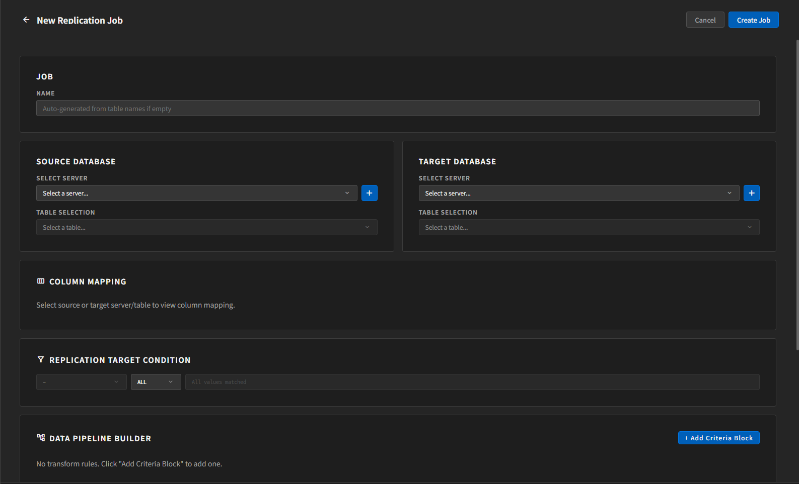
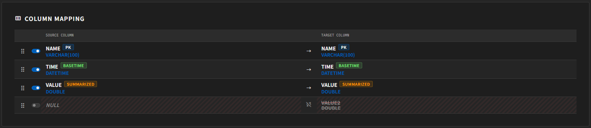
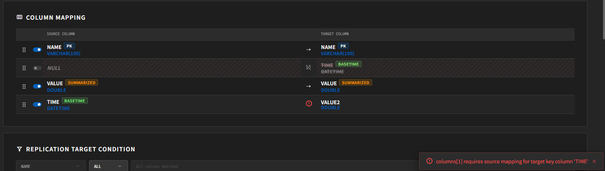

# Job 생성과 실행

이 문서는 새 복제 작업을 만들고 실행하는 과정을 설명합니다.

이 문서의 기본 예시는 **Source와 Target이 모두 `native` 서버인 경우**를 기준으로 합니다.  
다른 서버 유형도 선택할 수 있지만, 일반 사용자 관점에서는 먼저 `native` 구성을 익히는 편이 좋습니다.

## 새 Job 만들기

좌측 사이드바 상단의 `+` 버튼을 클릭하면 **New Replication Job** 화면이 열립니다.

## 1. Job 이름

`Job` 섹션에서 이름을 입력합니다.

- 영문, 숫자, `_`, `-`만 사용하는 것이 안전합니다.
- Job을 생성한 뒤에는 이름을 수정할 수 없습니다.

## 2. Source Database / Target Database

각각의 Database 카드에서 서버와 테이블을 선택합니다.

### Source Database

- 복제할 데이터를 읽어 올 서버를 선택합니다.
- Source 선택 목록에는 일반적으로 `native`, `http` 서버만 표시됩니다.
- 서버를 바꾸면 기존에 잡혀 있던 컬럼 매핑과 메타 매핑이 초기화됩니다.
- 테이블을 바꾸면 기존 매핑과 파이프라인 규칙이 초기화될 수 있으므로 주의해야 합니다.

### Target Database

- 데이터를 보낼 서버를 선택합니다.
- Target에서는 `native`, `http`, `mqtt-api`, `mqtt-publish`를 사용할 수 있습니다.
- `mqtt-api`, `mqtt-publish` 서버는 Target에서만 선택됩니다.
- 일반 DB를 선택한 경우에는 대상 테이블을 선택합니다.
- `mqtt-publish` 서버를 선택한 경우에는 테이블 선택 대신 **Topic** 입력 칸이 나타납니다.

`mqtt-publish`를 사용할 때는 Topic 형식을 함께 확인해야 합니다.

- 공백이 들어가면 안 됩니다.
- MQTT wildcard인 `+`, `#`를 사용할 수 없습니다.
- 앞이나 뒤가 `/`로 시작하거나 끝나면 안 됩니다.
- 일반적으로 영문자, 숫자, `.`, `_`, `-`, `/` 조합을 사용하는 것이 안전합니다.

## 3. Column Mapping

`Column Mapping`에서는 Source 컬럼을 Target 컬럼에 어떻게 대응시킬지 지정합니다.

- 같은 순서, 같은 이름으로 복제하지 않아도 됩니다.
- 필요한 컬럼만 활성화할 수 있습니다.
- 드래그로 순서를 조정할 수 있습니다.
- 타입이 다르면 경고 또는 오류 표시가 보일 수 있습니다.

실무에서는 먼저 Source/Target 테이블을 정확히 고른 뒤, 그 다음에 매핑을 손보는 편이 좋습니다.

## 4. Replication Target Condition

이 섹션은 **어떤 행만 복제할지** 결정합니다.

지원되는 조건은 다음과 같습니다.

- `ALL`
  - 모든 값을 복제합니다.
- `IN`
  - 지정한 값 목록만 복제합니다.
- `LIKE`
  - 패턴과 일치하는 값만 복제합니다.

`IN`을 사용할 때는 직접 값을 입력하거나 태그 선택 팝업에서 고를 수 있습니다.

## 5. Data Pipeline Builder

`Data Pipeline Builder`에서는 복제 중 값을 변형하거나 일부 값을 걸러낼 수 있습니다.

대표적인 예시는 다음과 같습니다.

- 문자열 앞에 접두어 붙이기
- 문자열 뒤에 접미어 붙이기
- 숫자에 bias / multiplier 적용
- 숫자 범위를 벗어난 값 필터링

이 섹션의 조건 블록은 `Replication Target Condition`에서 선택한 기준 컬럼과 연동됩니다.

주의할 점:

- Source 테이블을 바꾸면 파이프라인 규칙이 초기화될 수 있습니다.
- 숫자형 컬럼과 문자열 컬럼은 지원되는 변환 방식이 다릅니다.

## 6. Execution Settings

실행 방식과 읽기 주기를 조정합니다.

### Start Mode

- `Full (from RID 0)`
  - 처음부터 전체를 읽습니다.
- `Now (latest)`
  - 현재 시점 이후의 새 데이터만 따라갑니다.
- `RID After`
  - 지정한 RID 다음부터 시작합니다.

### On Save Failure

- `Continue`
  - 저장 실패가 있어도 가능한 범위에서 계속 진행합니다.
- `Abort`
  - 저장 실패가 나면 중단합니다.

### Query Limit

- 한 번에 읽는 최대 행 수입니다.

### Poll Interval (ms)

- 새 데이터를 다시 확인하는 주기입니다.

## 7. Advanced Settings

고급 옵션입니다.

- `Integrity Check`
  - 복구 시 일관성 검사를 수행합니다.
- `Retry Max Attempts`
  - 재시도 횟수
- `Retry Base Delay (ms)`
  - 초기 재시도 간격
- `Retry Max Delay (ms)`
  - 최대 재시도 간격

## 8. Logging Controls

로그 보존과 출력 수준을 정합니다.

- `Log Level`
  - TRACE, DEBUG, INFO, WARN, ERROR 중 선택
- `File Limit`
  - 보관할 로그 파일 개수

## 9. 저장 시 경고 확인

저장할 때 시스템은 자동으로 dry-run 검증을 수행합니다.  
해결되지 않은 오류가 있으면 저장할 수 없고, 치명적이지 않지만 확인이 필요한 경우에는 **Validation Warnings** 창이 뜹니다.

이 경우 사용자는 다음 중 하나를 선택합니다.

- `Cancel`
- `Save Anyway`

## 생성 후 확인할 일

일반적으로는 Job을 생성하면 바로 Replication이 시작되므로, 먼저 사이드바 목록에서 새 Job을 찾은 뒤 선택해서 상태를 확인하면 됩니다.  
생성 직후에는 목록이 다시 읽히면서 다른 Job 상세가 메인 화면에 남아 있을 수 있습니다.

확인할 항목:

1. 사이드바에서 새로 만든 Job이 목록에 나타나는지 확인합니다.
2. 해당 Job을 클릭해서 상세 화면을 연 뒤, 상태가 `running` 또는 대시보드의 `REPLICATING` / `IDLE STATE`로 보이는지 확인합니다.
3. 필요하면 스위치로 정지하거나 다시 시작합니다.

`Register` 버튼이 따로 보이는 경우는 일반적인 흐름이 아니라 예외 상황에 가깝습니다.  
이 경우에는 [문제 해결](./troubleshooting.kr.md)을 먼저 확인하는 편이 좋습니다.

## 수정과 삭제

- `Edit`
  - 정지된 Job만 수정하는 것이 안전합니다.
  - 실행 중인 Job은 편집 버튼이 비활성화될 수 있습니다.
- `Delete`
  - Job 설정과 관련 상태를 제거합니다.
  - 실행 중인 Job은 먼저 정지한 뒤 삭제하는 것이 일반적입니다.

## 사용자 주의사항

- Source 또는 Target 서버를 바꾸면 매핑을 다시 확인해야 합니다.
- Source 테이블을 바꾸면 Data Pipeline Builder 규칙도 다시 확인해야 합니다.
- `mqtt-api`, `mqtt-publish`는 Source 쪽에서 선택되지 않는 것이 정상입니다.
- Target이 `mqtt-publish`인 경우에는 Topic 값이 유효한지 반드시 확인해야 합니다.
- `Now`는 신규 데이터 추적에 적합하고, 초기 전체 복제가 필요하면 `Full`을 사용해야 합니다.

## 문서 이동

- [이전: Server 설정](./server-settings.kr.md)
- [목차로 돌아가기](./index.kr.md)
- [다음: 모니터링과 로그 확인](./monitoring-and-logs.kr.md)
