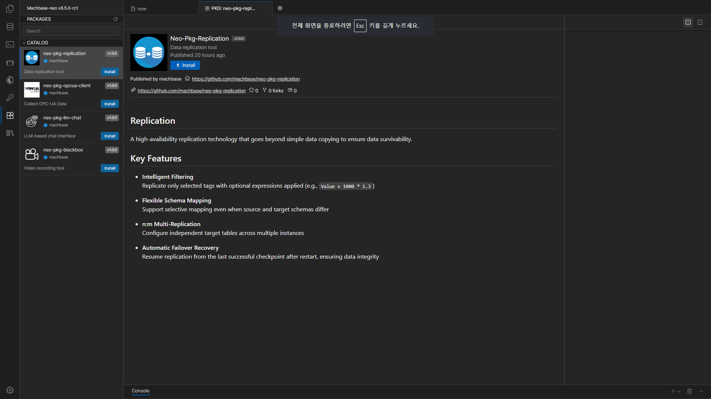
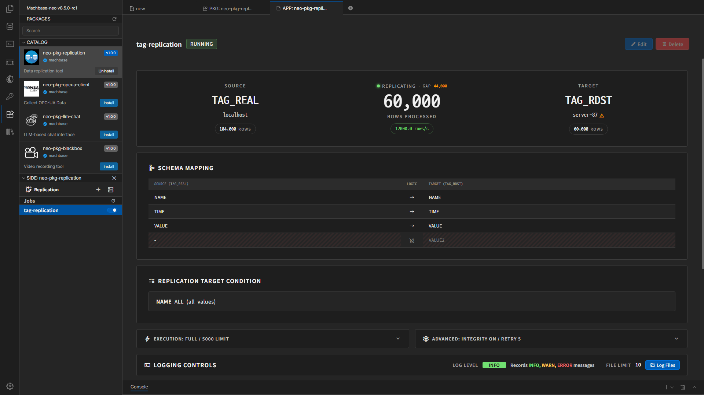

# Replication 사용자 매뉴얼

이 문서는 **Machbase Neo Replication 패키지**의 설치, 설정, Job 생성, 상태 확인, 로그 확인 방법을 설명합니다.

## 설치

Machbase Neo 좌측 사이드 패널에는 사용 가능한 패키지 목록이 표시됩니다.  
여기서 Replication 패키지를 선택하고 `Install` 버튼을 누르면 설치할 수 있습니다.

설치에는 약간의 시간이 걸릴 수 있으므로, 완료될 때까지 잠시 기다립니다.

## 이 문서에서 다루는 내용

- 패키지 설치
- Server 설정 등록과 연결 확인
- Replication Job 생성
- Job 생성, 시작, 정지, 삭제
- 대시보드에서 상태 확인
- 로그 파일 조회
- 화면에서 자주 만나는 경고와 점검 방법

## 기본 작업 순서

1. Neo에서 Replication 패키지를 설치합니다.
2. Source 서버와 Target 서버를 등록합니다.
3. 새 Replication Job을 생성합니다.
4. Job 생성 후 대시보드에서 상태를 확인합니다.
5. 문제가 있으면 경고 메시지와 로그 파일을 확인합니다.

## 화면 구성

- 좌측 사이드바: Job 목록, 새 Job 생성, Server Settings 열기
- 메인 화면: 선택한 Job의 상세 상태 또는 Job 생성/수정 화면
- 모달 창: Server 등록/수정, 로그 파일 조회, 태그 선택, 경고 확인

## 문서 목록

- [Server 설정](./server-settings.kr.md)
- [Job 생성과 실행](./create-and-run-job.kr.md)
- [모니터링과 로그 확인](./monitoring-and-logs.kr.md)
- [문제 해결](./troubleshooting.kr.md)

## 용어

| 용어 | 의미 |
| --- | --- |
| Server | 복제 대상이 되는 Machbase 또는 MQTT 연결 정보 |
| Job | 하나의 복제 작업 단위 |
| Source | 데이터를 읽어 오는 쪽. 일반적으로 `native` 또는 `http` 서버를 사용합니다. |
| Target | 데이터를 보내는 쪽. `native`, `http`, `mqtt-api`, `mqtt-publish`를 사용할 수 있습니다. |
| TAG / LOG | Machbase 테이블 유형 |
