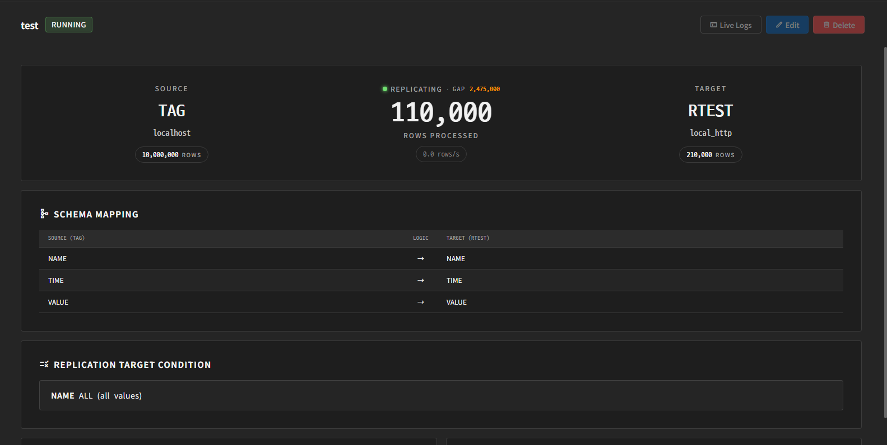
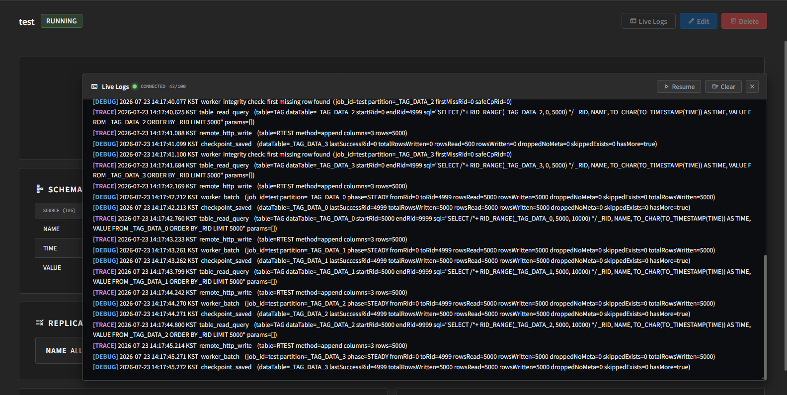
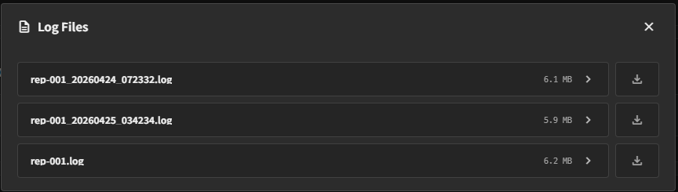

# 모니터링과 로그 확인

Job을 시작한 뒤에는 대시보드에서 상태를 확인하고, 필요하면 로그 파일을 조회합니다.

## 대시보드에서 보는 항목

Job을 선택하면 우측 상세 화면에 상태 정보가 표시됩니다.

주요 확인 항목:

- Job 이름
- 현재 상태 배지
- SOURCE / TARGET 서버와 테이블
- checkpoint 기준 진행 정보
- source / target row count
- partition gap 정보
- 경고 메시지
- 로그 설정
- Live Logs 버튼

## 상태 해석

대시보드와 사이드바에서 자주 보게 되는 상태는 다음과 같습니다.

- `running`
  - Job이 실행 중입니다.
- `stopped`
  - Job이 정지 상태입니다.
- `REPLICATING`
  - 현재 데이터를 따라가며 복제 중입니다.
- `IDLE STATE`
  - 실행 중이지만 현재 처리할 새 데이터가 많지 않은 상태입니다.

## 경고 메시지

대시보드 상단에는 Source 또는 Target 관련 경고가 표시될 수 있습니다.

예를 들어 다음과 같은 상황에서 경고가 나타날 수 있습니다.

- Source 테이블을 찾을 수 없음
- Target 테이블을 찾을 수 없음
- row count 조회 불가

운영 중에는 먼저 경고 문구를 확인하고, 그 다음 로그를 보는 순서가 좋습니다.

## SOURCE / TARGET row count

대시보드에는 source와 target의 현재 row count가 표시될 수 있습니다.

- 값이 보이면 현재 테이블 기준 개수를 뜻합니다.
- 비어 있으면 해당 방식에서는 조회를 지원하지 않거나 일시적으로 확인되지 않은 상태일 수 있습니다.

이 값은 운영자가 복제량을 빠르게 확인하는 데 유용합니다.

## 실시간 로그 보기

대시보드 상단의 **Live Logs** 버튼을 누르면 실행 중 Job의 active 로그를 별도 팝업으로 볼 수 있습니다.

팝업을 열 때 실시간 로그 연결이 시작되고, 닫으면 연결도 종료됩니다.

실시간 로그의 특징:

- 현재 Job의 active 로그 파일을 실시간으로 따라갑니다.
- 팝업을 연 뒤 새로 들어오는 로그를 중심으로 보여주며 과거 전체 로그를 다시 불러오지는 않습니다.
- 최근 로그는 최대 100줄까지 화면에 유지됩니다.
- 로그 레벨을 `WARN`이나 `ERROR`처럼 제한적으로 설정했거나 최근 새 로그가 거의 없으면 화면이 비어 있을 수 있습니다.
- 팝업의 제목 영역을 드래그해 위치를 옮기고, 가장자리나 오른쪽 아래 모서리를 드래그해 크기를 조절할 수 있습니다.

화면에서 가능한 동작:

- `Pause` / `Resume`
- `Clear`
- 연결 상태 확인 (`CONNECTED` / `DISCONNECTED`)
- 닫기

실시간 로그는 실행 중 상태를 빠르게 확인하는 데 적합하고, 과거 로그 전체 조회나 저장은 **Log Files** 쪽이 더 적합합니다.

## Log Files 열기

Logging Controls 영역의 **Log Files** 버튼을 누르면 현재 Job의 로그 파일 목록이 열립니다.

## 로그 파일 목록

첫 번째 화면에서는 해당 Job과 관련된 로그 파일 목록을 볼 수 있습니다.

보통 다음 정보를 확인합니다.

- 파일 이름
- 파일 크기
- 다운로드 버튼

과거의 로그 파일이 남아 있다면 목록에서 함께 보일 수 있습니다.

로그 파일은 다음 규칙으로 관리됩니다.

- 로그 시각은 Machbase Neo가 실행되는 호스트의 로컬 시간대를 사용합니다.
- active 로그 파일이 10MB에 도달하면 이름에 시각이 포함된 파일로 회전됩니다.
- `File Limit`은 active 파일과 회전된 파일을 합쳐 보관할 최대 파일 수입니다.

## 로그 파일 내용 보기

파일을 선택하면 전체 로그 내용을 페이지 단위로 볼 수 있습니다.

화면에서 가능한 동작:

- 이전/다음 페이지 이동
- 줄 바꿈 보기
- 다시 불러오기
- 뒤로 가기
- 파일 다운로드는 목록 화면에서 수행합니다.

로그 레벨 태그는 TRACE, DEBUG, INFO, WARN, ERROR 형태로 강조 표시됩니다.

## 운영 중 권장 확인 순서

문제가 의심될 때는 다음 순서로 확인하면 됩니다.

1. Job 상태가 `running`인지 확인
2. 경고 메시지가 있는지 확인
3. source / target row count가 기대와 비슷한지 확인
4. Live Logs에서 현재 동작을 확인
5. 필요하면 Log Files에서 과거 로그를 열거나 다운로드

## 사용자 주의사항

- Live Logs는 최신 상태 확인용이고, 과거 로그 보관/다운로드는 Log Files가 담당합니다.
- Live Logs는 예전 로그를 다시 불러오는 기능이 아니라 현재 발생하는 로그를 보는 기능입니다.
- Live Logs 연결은 팝업을 열 때 시작되고 닫을 때 종료됩니다.
- 로그 레벨을 제한적으로 설정하면 Live Logs에 거의 아무 내용도 보이지 않을 수 있습니다.
- 로그가 많으면 파일 내용이 페이지 단위로 나뉘어 보일 수 있습니다.
- 로그 레벨을 너무 낮게 두면 파일이 빠르게 증가할 수 있습니다.

## 문서 이동

- [이전: Job 생성과 실행](./create-and-run-job.kr.md)
- [목차로 돌아가기](./index.kr.md)
- [다음: 문제 해결](./troubleshooting.kr.md)
