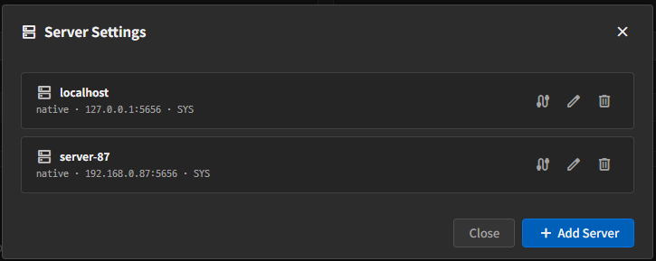
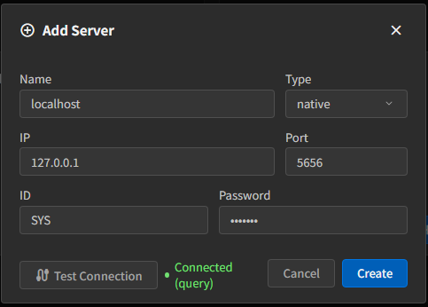

# Server 설정

Replication Job을 만들기 전에 먼저 연결할 서버를 등록해야 합니다.

이 문서에서는 **가장 일반적인 `native` 서버 등록 방식**을 중심으로 설명합니다.  
다른 서버 유형도 지원하지만, 일반 사용자 매뉴얼에서는 제약사항만 간단히 안내합니다.

## Server Settings 열기

좌측 사이드바 상단의 `dns` 아이콘을 클릭하면 **Server Settings** 창이 열립니다.

## 먼저 권장하는 방식

처음 사용하는 경우에는 **Source와 Target 모두 `native` 서버로 등록**하는 것을 권장합니다.

이유는 다음과 같습니다.

- 설정 항목이 가장 단순합니다.
- 테이블 조회와 매핑 확인이 쉽습니다.
- Job 생성 화면과 대시보드 동작을 이해하기 가장 쉽습니다.

이 문서의 기본 예시도 `native` 기준으로 설명합니다.

## 새 서버 추가

1. **Add Server**를 클릭합니다.
2. `Name`을 입력합니다.
3. `Type`에서 `native`를 선택합니다.
4. `IP`와 `Port`를 입력합니다.
5. 서버 유형에 맞는 인증 정보를 입력합니다.
6. 필요하면 **Test connection**으로 연결을 먼저 확인합니다.
7. **Save**로 저장합니다.

## 항목 설명

### 공통 항목

- `Name`
  - 화면에서 서버를 구분하는 이름입니다.
  - Job에서 이 이름을 선택해 Source 또는 Target에 연결합니다.
- `Type`
  - 연결 방식입니다.
- `IP`
  - 대상 서버의 주소입니다.
- `Port`
  - 대상 서버의 포트입니다.

### `native`에서 입력하는 항목

- `ID`
  - Machbase 계정입니다.
- `Password`
  - 해당 계정의 비밀번호입니다.

기본적인 Source/Target 복제는 보통 이 입력만으로 충분합니다.

## 다른 서버 유형

화면에서는 다음 유형도 선택할 수 있습니다.

- `http`
- `mqtt-api`
- `mqtt-publish`

일반 사용자 관점에서는 다음 정도만 기억하면 됩니다.

- `http`
  - HTTP 기반 연결입니다.
  - `IP`, `Port`, `Token`을 사용합니다.
- `mqtt-api`
  - MQTT API 방식입니다.
  - `Token`, `QoS` 같은 추가 입력이 필요합니다.
  - **Target 전용**으로 보는 것이 맞습니다.
- `mqtt-publish`
  - **Target 전용**으로 생각하면 됩니다.
  - 일반 DB 테이블이 아니라 MQTT Topic으로 데이터를 보냅니다.

즉, 처음에는 `native`로 시작하고, 특별한 연동 목적이 있을 때만 다른 유형을 선택하는 편이 좋습니다.

## 다른 유형 사용 시 제약사항

- Source 선택 목록에는 보통 `native`, `http` 서버만 나타납니다.
- `mqtt-api`, `mqtt-publish`는 Target 전용으로 보는 것이 맞습니다.
- `mqtt-publish`를 Target으로 선택하면 Job 생성 화면에서 테이블 대신 **Topic**을 입력합니다.
- `http`, `mqtt-api`, `mqtt-publish`는 `native`보다 입력 항목이 더 많고 운영 조건이 다를 수 있습니다.
- 일반적인 테이블 복제 점검은 `native` 구성이 가장 직관적입니다.

## 연결 테스트

서버 목록에서 케이블 아이콘을 누르면 연결 테스트를 수행합니다.

- 성공 시: `Connected`
- 실패 시: 실패 메시지가 서버 이름 옆에 표시됩니다.

서버를 저장하기 전에도 테스트할 수 있고, 이미 저장된 서버도 다시 테스트할 수 있습니다.

## 수정과 삭제

- `Edit`
  - 저장된 서버의 연결 정보를 수정합니다.
  - 기존 서버를 수정할 때는 `Name`과 `Type`은 고정됩니다.
  - 비밀번호나 토큰을 비워 두면 기존 값이 유지됩니다.
- `Delete`
  - 서버를 삭제합니다.
  - 이 서버를 참조하는 Job이 있으면 삭제할 수 없습니다.
  - 해당 Job의 Source 또는 Target 서버를 먼저 변경하거나 Job을 삭제한 뒤 다시 시도합니다.

## 사용자 주의사항

- Source에 사용할 서버는 실제로 테이블 조회가 가능한지 먼저 테스트하는 것이 좋습니다.
- `mqtt-api`, `mqtt-publish`는 Source 쪽에서 선택되지 않는 것이 정상입니다.
- Target이 `mqtt-publish`인 경우에는 테이블 대신 **Topic**으로 전송됩니다.
- 편집 화면에서 비밀번호나 토큰을 다시 입력하지 않아도 기존 값은 유지됩니다.
- Job이 참조 중인 서버는 삭제가 거부되는 것이 정상입니다.

## 문서 이동

- [목차로 돌아가기](./index.kr.md)
- [다음: Job 생성과 실행](./create-and-run-job.kr.md)
